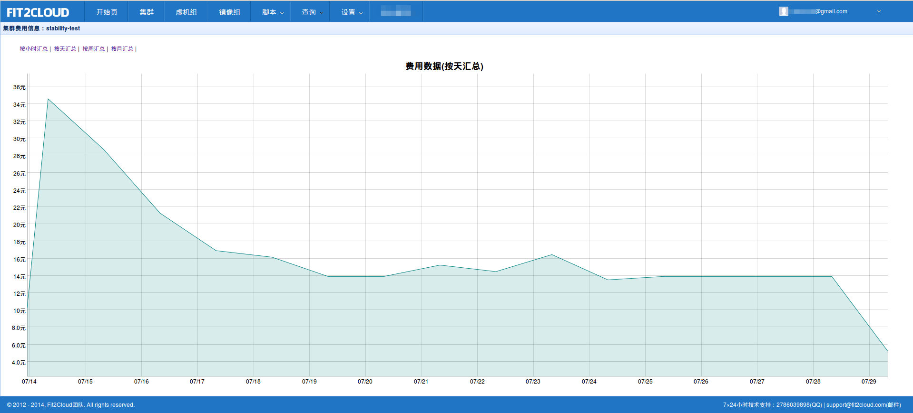
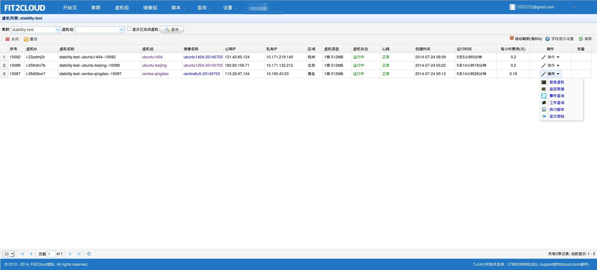
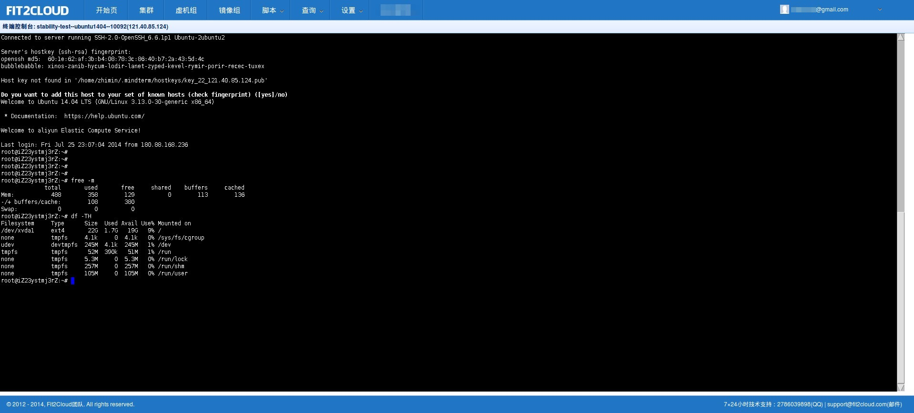
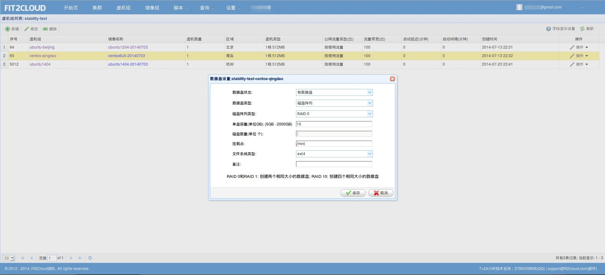
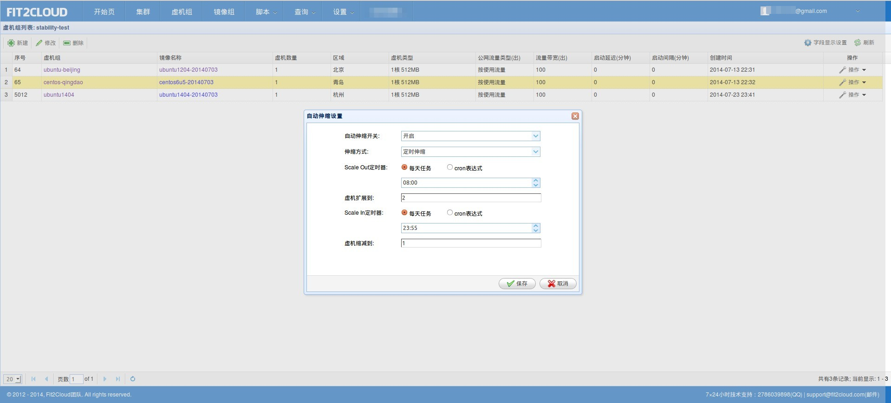
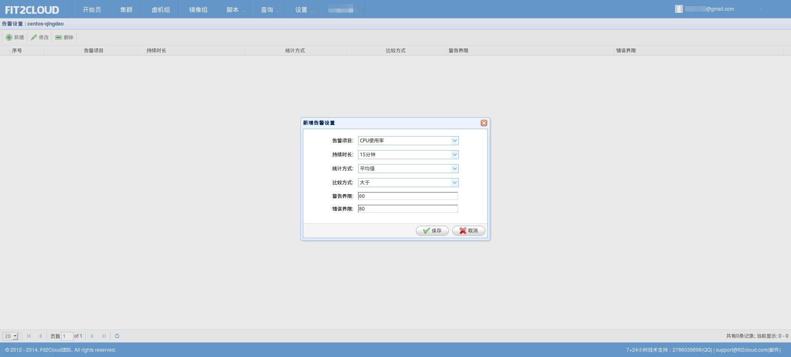
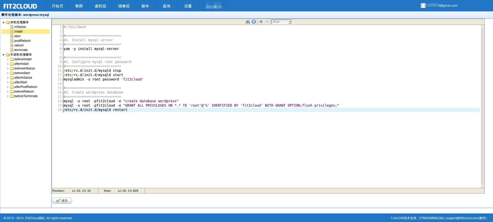
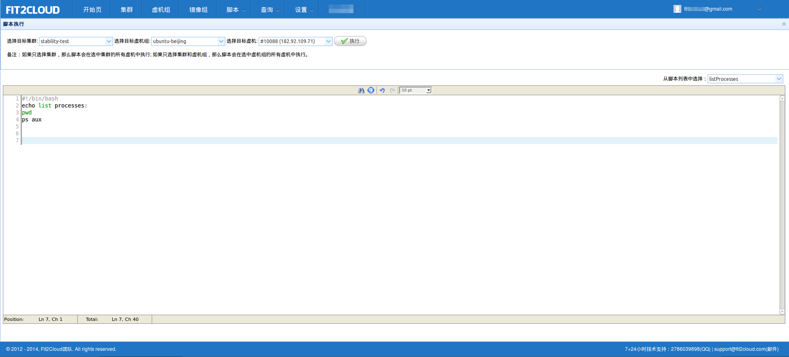
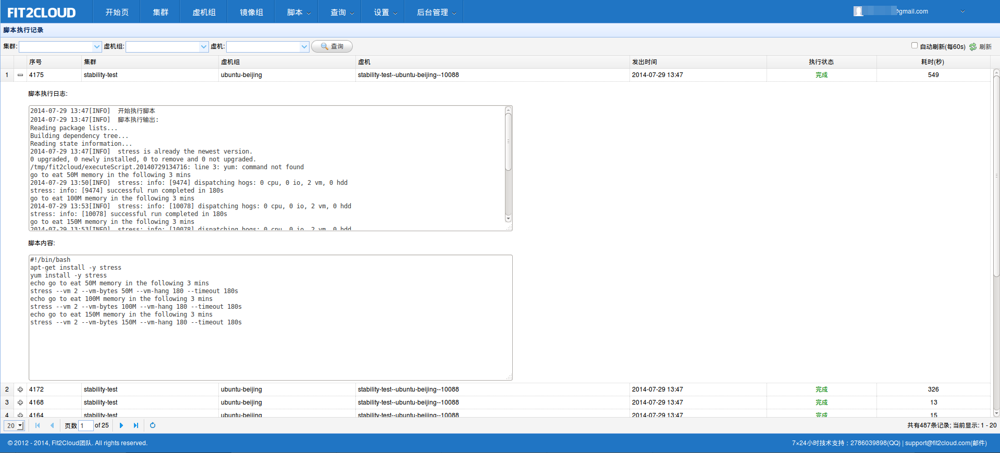

FIT2CLOUD功能截屏
=====================================

1. 集群列表

.. image:: _static/1-clusters.png
   :target: http://docs.fit2cloud.com/aliyun/_images/1-clusters.png
   
2. 集群费用可视化

3. 虚机列表

4. 虚机监控数据(OS级别)

.. image:: _static/4-monitoring.png
   :target: http://docs.fit2cloud.com/aliyun/_images/4-monitoring.png

5. 集成SSH终端

6. 数据盘设置(RAID)

7. 自动伸缩设置

8. 告警设置

9. Lifecycle事件处理

10. 安全组设置

.. image:: _static/10-securitygroup.png
   :target: http://docs.fit2cloud.com/aliyun/_images/10-securitygroup.png

11. 执行脚本

12. 查看脚本执行结果

