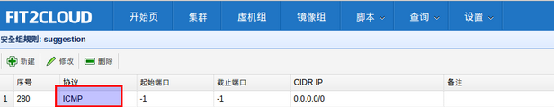
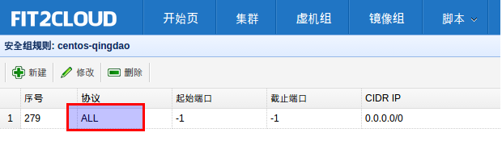

FIT2CLOUD For 阿里云 常见问题
================================================================

| **Q: 启动集群后，怎么一台虚拟机都没有起来?** 
|
|     情况一: 集群虚拟机组的虚拟机数量为0
|        请检查集群的虚拟机组的设置，虚拟机数是否大于0, 一般每次在集群的虚拟机列表页面中，关闭
| 一台虚拟机后，FIT2CLOUD会把虚拟机组的虚拟机数量减1
|
|     情况二: 没有绑定阿里云或AWS的Access Key
|
|     情况三: 阿里云Access Key的帐户余额小于100
|
|     情况四: 超过阿里云或AWS帐号允许启动的虚拟机限额。阿里云默认帐户最多能启动10个虚拟机。
|
| **Q: 如果已经绑定了阿里云或AWS的AccessKey, 并且已经用这个Key启动了多台虚拟机，多个虚拟机正在运行，这时能否更改AccessKey?**
|
|     是可以更改的，只要更改为同一个账户下的AccessKey，那么就没什么问题。
|     但是，如果更改为另外一个账户下的AccessKey, 那么用旧的AccessKey启动的虚拟机就无法从FIT2CLOUD控制台关闭了。
|     这个需要注意。
|
| **Q: 为什么FIT2CLOUD For 阿里云 创建的虚拟机是按量付费的？**
|
|    如果使用阿里云运行应用的话，FIT2CLOUD是通过调用阿里云的ECS API创建虚机的，通过ECS API创建的虚机都是按量
| 付费类型的。如果您的虚机是临时使用的(从几分钟到几天)，比如用来搭建QA测试环境等，那么按量付费是非常合适的。如果您
| 是虚拟机需要长时间运行（1个月以上），那么按量付费的虚机会比包月的虚机贵不少。我们相信阿里云在不久的将来会大幅降低
| 按量付费的价格。另一方面，FIT2CLOUD后续也会支持导入包年包月的虚拟机进行管理。
|
| **Q: 为什么使用FIT2CLOUD要先绑定阿里云的Access Key？**
|
|    当您要求FIT2CLOUD创建应用运行所需的环境即虚拟机及存储时, 需要调用阿里云的API。
|
| **Q: 为什么无法Ping通虚机?**
|     虚机组默认的安全组规则只打开SSH 22端口，为了安全起见，其他端口都是关闭了。如果想Ping通，你需要在安全组中增加ICMP规则，如下图所示。

| **Q: 为什么无法通过内网访问已有包月虚机?怎么才能访问**
|     问题原因：通过FIT2CLOUD启动的按量付费机器没有加入包月机器默认安全组。FIT2CLOUD为了安全起见，只开放用户在安全组中开通的端口。
|     解决办法：如果用户想让FIT2CLOUD中启动的虚机通过内网访问包月机器，那么需要在安全组中增加ALL规则，如下图所示。

| **Q: SDK有Python版本吗?**
|     有，请访问git@github.com:fit2cloud/fit2cloud-python-sdk.git获取。
|     您可以以命令行方式使用，也可以将其引入应用程序使用。

.. code:: python
    
    命令行方式使用:
    ./f2cs.py config --endpoint=<endpoint> --id=<access key id> --secret=<access key secret>
    ./f2cs.py listClusters --cluster-name=<cluster name>
    ./f2cs.py listClusterRoles --cluster-name=<cluster name>
    ./f2cs.py listClusterServers --cluster-name=<cluster name>
    ./f2cs.py listClusterVMGroupServers --cluster-name=<cluster name> --cluster-vmgroup-name=<cluster vmgroup name>
    ./f2cs.py executeScript --cluster-name=<cluster name> --cluster-vmgroup-name=<cluster vmgroup> --cluster-server-id=<cluster server id> --script-file=<script file path> 
    ./f2cs.py getScriptLog --execution-id=<execution id>
    ./f2cs.py -h | --help
    ./f2cs.py -v | --version

| **Q: HostName可以自定义?**
|    可以。FIT2CLOUD支持三种方式的hostname命名规则：默认（不更改）；采用虚机组名称+内网IP；自定义前缀+序号。

| **Q: 可以关联阿里云RDS吗?**

可以，请点击 `关联阿里云RDS <set_rds_aliyun.html>`_

| **Q: 如何配置阿里云负载均衡?**

可以，请点击 `配置阿里云负载均衡 <set_slb_aliyun.html>`_

   