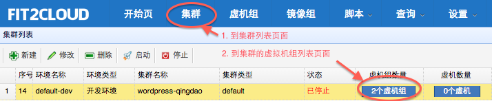
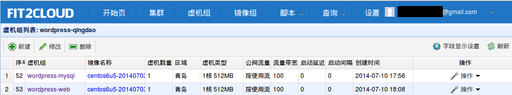
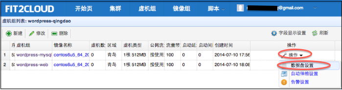
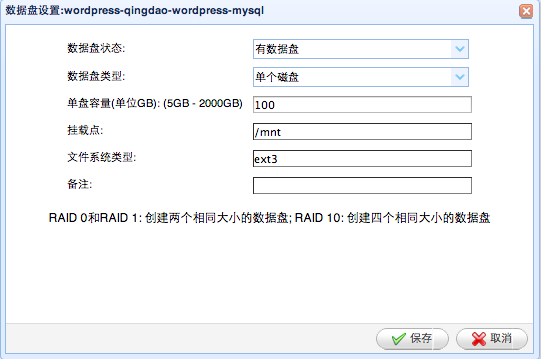
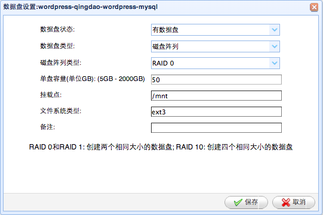
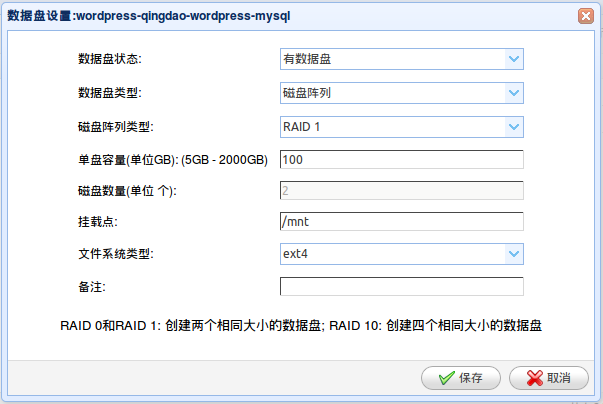
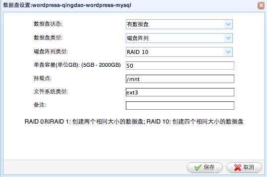

设置数据盘(RAID)
===========================

这里我们仍然以在阿里云上建立一个wordpress网站为例，为wordpress mysql分别配置一块大小为100G的普通数据盘，
Raid0，Raid1，Raid10数据盘。

一: 设置普通盘
-----------------
    这里，我们给wordpress mysql配置大小为100G的普通数据盘:

    第一步: 首先在页面最上方一行点击 "集群" 进入集群列表页面;

    第二步: 在集群页面找到wordpress-qingdao集群,然后点击集群所在行的 "虚拟机组" 进入虚
 拟机组列表页面;

    第三步: 在集群虚拟机组页面中找到wordpress-mysql虚拟机组，并点击这个虚拟机组的
 所在行最右边一列的 "操作", 在操作的下来菜单中点击 "数据盘设置" 进入数据盘设置页面;

  第四步: 在数据盘设置页面 (如下图示)
  a) 数据盘状态选择 "有数据盘"
  b) 数据盘类型选择 "单个磁盘"
  c) 单盘容量填写 "100"
  d) 挂载点保持默认 "/mnt"
  e) 文件系统类型保持默认ext4,或者选择ext3

  第五步: 数据盘设置页面， 点击 "保存"
  
  当wordpress-mysql虚拟机组的虚拟机启动后，FIT2CLOUD就会自动做一个100G大小的数据盘
 然后格式化成指定的文件系统类型，挂载到指定的挂载点。

二: 设置Raid0
-----------------

    这里，我们给wordpress mysql配置大小为100G的Raid0数据盘:

    在FIT2CLOUD中，为简化，我们做Raid0和Raid1都使用两块数据盘来做，所以配置100G的
 Raid0数据盘，需要两块50G的数据盘。

    第一步: 首先在页面最上方一行点击 "集群" 进入集群列表页面;

    第二步: 在集群页面找到wordpress-qingdao集群,然后点击集群所在行的 "虚拟机组" 进入虚
 拟机组列表页面;

    第三步: 在集群虚拟机组页面中找到wordpress-mysql虚拟机组，并点击这个虚拟机组的
 所在行最右边一列的 "操作", 在操作的下来菜单中点击 "数据盘设置" 进入数据盘设置页面;

  第四步: 在数据盘设置页面 (如下图示)

|  a) 数据盘状态选择 "有数据盘"
|  b) 数据盘类型选择 "磁盘阵列"
|  c) 磁盘阵列类型选择 "Raid0"
|  d) 单盘容量填写 "50"
|  e) 挂载点保持默认 "/mnt"
|  f) 文件系统类型保持默认ext4,或者选择ext3

  第五步: 数据盘设置页面， 点击 "保存"
  
  当wordpress-mysql虚拟机组的虚拟机启动后，FIT2CLOUD就会自动做一个100G大小的Raid0
 数据盘，然后格式化成指定的文件系统类型，挂载到指定的挂载点。

三: 设置Raid1
-----------------

    这里，我们给wordpress mysql配置大小为100G的Raid1数据盘:

    在FIT2CLOUD中，为简化，我们做Raid0和Raid1都使用两块数据盘来做，所以配置100G的
 Raid1数据盘，需要两块100G的数据盘。

    第一步: 首先在页面最上方一行点击 "集群" 进入集群列表页面;

    第二步: 在集群页面找到wordpress-qingdao集群,然后点击集群所在行的 "虚拟机组" 进入虚
 拟机组列表页面;

    第三步: 在集群虚拟机组页面中找到wordpress-mysql虚拟机组，并点击这个虚拟机组的
 所在行最右边一列的 "操作", 在操作的下来菜单中点击 "数据盘设置" 进入数据盘设置页面;

  第四步: 在数据盘设置页面 (如下图示)

|  a) 数据盘状态选择 "有数据盘"
|  b) 数据盘类型选择 "磁盘阵列"
|  c) 磁盘阵列类型选择 "Raid1"
|  d) 单盘容量填写 "100"
|  e) 挂载点保持默认 "/mnt"
|  f) 文件系统类型保持默认ext4,或者选择ext3

  第五步: 数据盘设置页面， 点击 "保存"
  
  当wordpress-mysql虚拟机组的虚拟机启动后，FIT2CLOUD就会自动做一个100G大小的Raid1
 数据盘，然后格式化成指定的文件系统类型，挂载到指定的挂载点。

四: 设置Raid10
-----------------

    这里，我们给wordpress mysql配置大小为100G的Raid10数据盘:

    在FIT2CLOUD中，为简化，我们做Raid0和Raid1都使用两块数据盘来做，所以配置100G的
 Raid10数据盘，需要4块50G的数据盘, 先用其中两块50G的盘做成50G的Raid1,再把剩下两块50G
 的盘做成50G的Raid1, 之后把两块50G的Raid1盘做成一块100G的Raid10盘。

    第一步: 首先在页面最上方一行点击 "集群" 进入集群列表页面;

    第二步: 在集群页面找到wordpress-qingdao集群,然后点击集群所在行的 "虚拟机组" 进入虚
 拟机组列表页面;

    第三步: 在集群虚拟机组页面中找到wordpress-mysql虚拟机组，并点击这个虚拟机组的
 所在行最右边一列的 "操作", 在操作的下来菜单中点击 "数据盘设置" 进入数据盘设置页面;

  第四步: 在数据盘设置页面 (如下图示)

|  a) 数据盘状态选择 "有数据盘"
|  b) 数据盘类型选择 "磁盘阵列"
|  c) 磁盘阵列类型选择 "Raid10"
|  d) 单盘容量填写 "50"
|  e) 挂载点保持默认 "/mnt"
|  f) 文件系统类型保持默认ext4,或者选择ext3

  第五步: 数据盘设置页面， 点击 "保存"
  
  当wordpress-mysql虚拟机组的虚拟机启动后，FIT2CLOUD就会自动做一个100G大小的Raid10
 数据盘，然后格式化成指定的文件系统类型，挂载到指定的挂载点。

