阿里云：代码部署功能指南
====================================
| FIT2CLOUD提供了代码部署功能，它可以帮助开发人员自动化的部署任意指定版本的应用程序到一组虚机上。
| 整个部署过程是可视的、可控、标准化的。FIT2CLOUD代码部署服务和AWS CodeDeploy类似，我们也兼容AWS CodeDeploy
| 所定义的应用Artifact格式。 
|
| 和传统部署方式相比：FIT2CLOUD和AWS代码部署的特点是：
|
| **1) 应用代码和部署脚本是一体的。**
|
| 如下图所示，应用artifact zip包中除了包括WordPress应用代码外，还包括appspec.yml和scripts目录。
| appspec.yml文件定义了这个应用是如何进行部署的，部署中要执行的脚本则放在scripts目录下面。
|
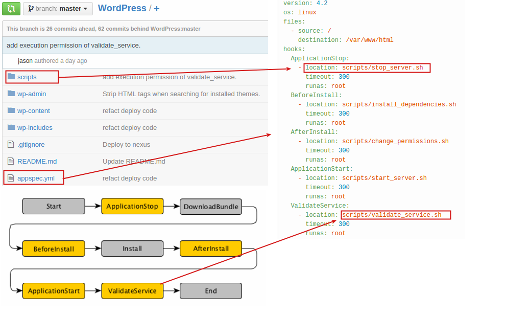
|
| **2) 应用架构采用SOA/微服务，支持各个应用组件的局部独立部署。**
|
| 这里, 我们仍然以wordpress网站为例, 介绍如何使用FIT2CLOUD代码部署服务来部署WordPress应用。

一: 应用打包、并上传到仓库中
-------------------------------------
|
| 请参考我们在GitHub上面的示例WordPress工程： `WordPress <https://github.com/fit2cloud/WordPress>`_
|
| 这个工程中新增中文件包括：
|
| 1) pom.xml/assembly.xml: 我们使用maven来打包应用artifact，并发布到Nexus仓库中去。
| 2) appspec.yml: 这个文件定义了应用部署中各个hooks所绑定的脚本。
| 3) scripts/change_permissions.sh等: 这个目录中包括WordPress部署时需要执行的脚本。
|
| 除了上传到Nexus仓库外，FIT2CLOUD还支持用阿里云OSS来存储Artifact。我们提供了Jenkins插件，用户可以非常方便的在
| Jenkins构建后将artifact上传到阿里云OSS中。具体请参考：
|
| `在Jenkins持续集成方案中使用阿里云OSS作为Artifacts仓库 <http://blog.fit2cloud.com/2015/01/20/aliyun-oss-jenkins-plugin.html>`_
|
二: 创建代码仓库
-------------------------------------
|
| **1) 在导航栏中"代码部署"项里, 选择"仓库管理"**
|
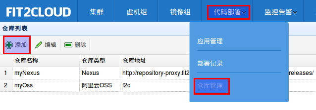
|
| **2) 填写代码仓库的相关配置信息并保存**
|
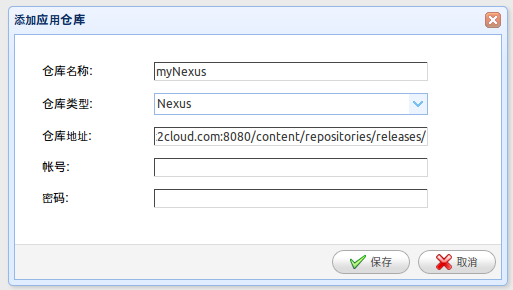
|
| 1) 仓库名称：myNexus
| 2) 仓库类型：Nexus
| 3）仓库地址：http://repository-proxy.fit2cloud.com:8080/content/repositories/releases/ 
|
| **3) 在代码仓库列表中查看刚刚创建的仓库的状态**
|
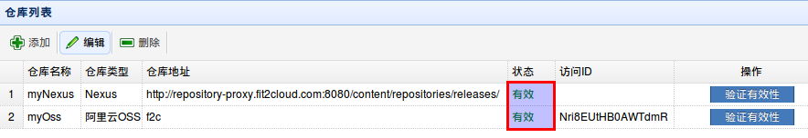
|
|  只有状态为"有效"的仓库才能在后续的步骤中被使用到。若状态为“无效”，请检查仓库的相关配置信息是否填写正确。
|
三: 新建应用程序
-------------------------------------
|
| **1) 在导航栏中"代码部署"项里, 选择"应用管理"**
|
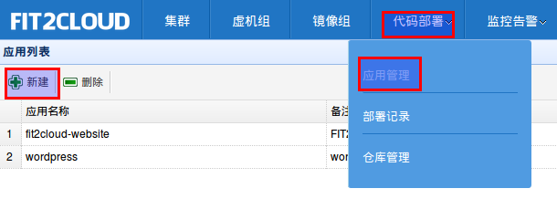
|
| **2) 填写应用程序的相关信息并保存**
|
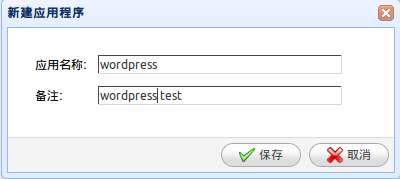
|
| **3) 查看应用列表**
|
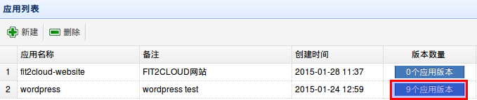
|
|
四: 添加应用程序版本
-------------------------------------
|
| **1) 在上一个步骤中的应用列表里，点击"版本数量"，进入到添加应用程序版本页面，添加应用版本**
|
.. image:: _static/011-CodeDeploy-8-AddApplicationRevision.png
|
| 1) 版本名称：build-16
| 2) 仓库类型：Nexus
| 3) 选择仓库：myNexus
| 3）存放路径：com/fit2cloud/example/wordpress/4.2/wordpress-4.2-bin-201501290222-16.zip
| 
| 填写完毕后，保存即可。实际上，这个应用的artifact下载全地址即为：
.. code:: python

	
http://repository-proxy.fit2cloud.com:8080/content/repositories/releases/com/fit2cloud/example/wordpress/4.2/wordpress-4.2-bin-201501290222-16.zip

五: 部署应用
-------------------------------------
| 注意：部署之前，请预先启动好一个集群，这个集群中有正在运行中的CentOS 6虚机。
|
| **1) 在应用程序版本列表里，点击应用版本对应的"部署"，填写应用版本的相关信息并保存**
|
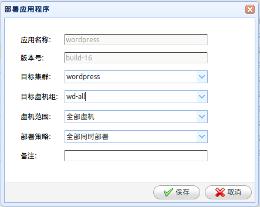
|
|  FIT2CLOUD的代码部署，可以指定一台虚机，也可以选择一个范围的虚机进行部署。
|  部署的策略有三种：
|  > 全部同时部署
|  > 半数分批部署
|  > 单台依次部署
|
|  当您选择“保存”后，FIT2CLOUD后台将会开始进行代码部署的工作。
|
六: 查看部署过程和结果
-------------------------------------
|
| **1) 在导航栏中"代码部署"项里, 选择"部署记录"**
|
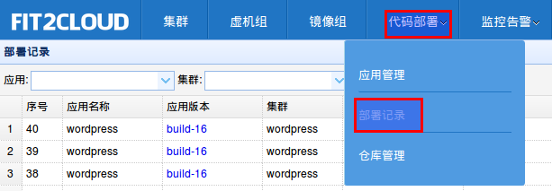
|
|
| **2) 查看部署记录列表**
|
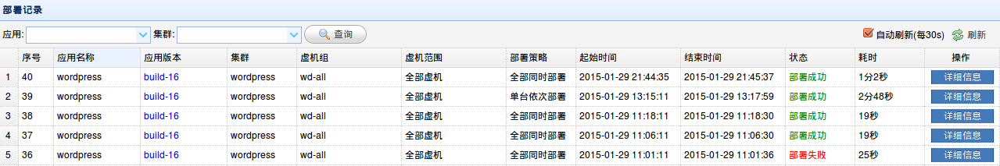
|
| **3) 点击部署记录对应的"详细信息"按键查看对应的各个虚机部署情况**
|
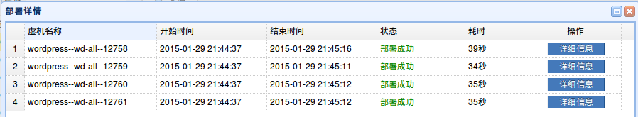
|
| **4) 点击单台虚机对应的"详细信息"按键查看该虚机的具体部署过程**
|
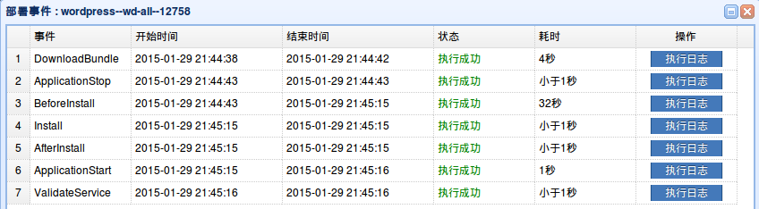
|
| **4) 点击单台虚机对应的"详细信息"按键查看该虚机的具体部署过程**
|
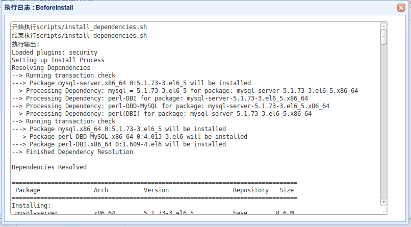
|