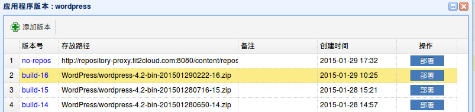

阿里云：代码部署功能快速入门
====================================
|
|    FIT2CLOUD提供了代码部署功能，它可以帮助开发人员自动化的部署任意指定版本的应用程序到虚机上。整个部署过程全程可视化。
|    

一: 创建代码仓库
-------------------------------------
|
| **1) 在导航栏中"代码部署"项里, 选择"仓库管理"**
|
.. image:: _static/011-CodeDeploy-1-SelectRepoManagementPage.png
|
| **2) 填写代码仓库的相关配置信息并保存**
|
.. image:: _static/011-CodeDeploy-2-CreateApplicationRepo.png
|
|  目前FIT2CLOUD支持"阿里云OSS"及"Nexus"两种类型仓库的创建。
|
|
| **3) 在代码仓库列表中查看刚刚创建的仓库的状态**
|
.. image:: _static/011-CodeDeploy-3-ApplicationRepoList.png
|
|  只有状态为"有效"的仓库才能在后续的步骤中被使用到。若状态为“无效”，请检查仓库的相关配置信息是否填写正确。
|
|
二: 新建应用程序
-------------------------------------
|
| **1) 在导航栏中"代码部署"项里, 选择"应用管理"**
|
.. image:: _static/011-CodeDeploy-4-SelectAppManagementPage.png
|
| **2) 填写应用程序的相关信息并保存**
|
.. image:: _static/011-CodeDeploy-5-CreateApplication.png
|
| **3) 查看应用列表**
|
.. image:: _static/011-CodeDeploy-6-ApplicationList.png
|
|
三: 添加应用程序版本
-------------------------------------
|
| **1) 在上一个步骤中的应用列表里，点击应用程序对应的"版本数量"，进入到添加应用程序版本页面，添加应用版本**
|

|
| **2) 填写应用版本的相关信息并保存**
|
.. image:: _static/011-CodeDeploy-8-AddApplicationRevision.png
|
|  添加应用版本时，若无对应仓库，您也可以在“仓库类型”中选择“无”，并将应用程序的完整下载地址填写到“版本下载地址”中。
|
四: 部署应用
-------------------------------------
|
| **1) 在应用程序版本列表里，点击应用版本对应的"部署"，填写应用版本的相关信息并保存**
|
.. image:: _static/011-CodeDeploy-9-CreateApplicationDeployment.png
|
|  FIT2CLOUD的代码部署，可以指定一台虚机，也可以选择一个范围的虚机进行部署。
|  部署的策略有三种：
|  > 全部同时部署
|  > 半数分批部署
|  > 单台依次部署
|  当您选择“保存”后，FIT2CLOUD后台将会开始进行代码部署的工作。
|
|
五: 查看部署
-------------------------------------
|
| **1) 在导航栏中"代码部署"项里, 选择"部署记录"**
|
.. image:: _static/011-CodeDeploy-10-SelectDeploymentPage.png
|
|
| **2) 查看部署记录列表**
|
.. image:: _static/011-CodeDeploy-11-DeploymentList.png
|
|
| **3) 点击部署记录对应的"详细信息"按键查看对应的各个虚机部署情况**
|
.. image:: _static/011-CodeDeploy-12-DeploymentLogList.png
|
|
| **4) 点击单台虚机对应的"详细信息"按键查看该虚机的具体部署过程**
|
.. image:: _static/011-CodeDeploy-13-DeploymentEventLogList.png
|
|
| **4) 点击单台虚机对应的"详细信息"按键查看该虚机的具体部署过程**
|
.. image:: _static/011-CodeDeploy-14-DeploymentEventLogData.png
|
|
