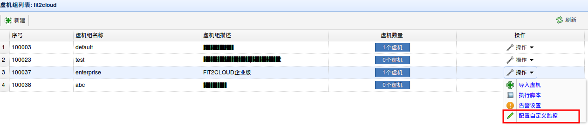
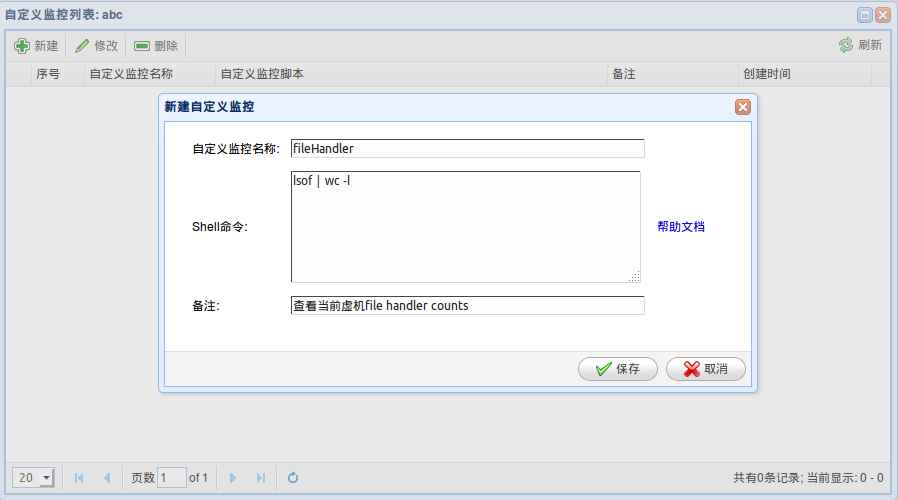
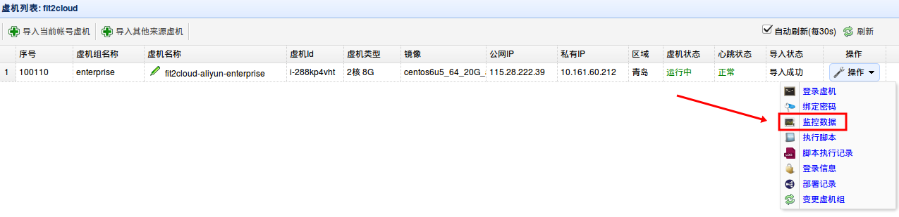
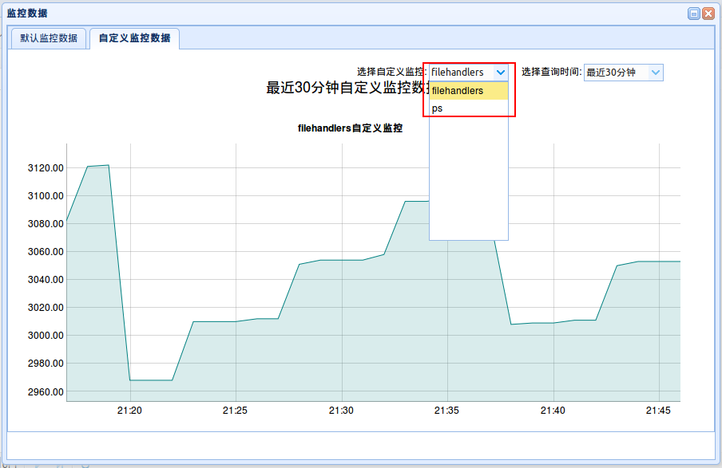

阿里云：自定义监控功能指南
====================================
| FIT2CLOUD 提供用户自定义虚机监控功能，通过编写自定义监控脚本，设定监控规则，可以在页面上方便的
| 查看监控数据，支持多个自定义监控规则，并且支持多时间窗口的监控数据查看。
|
| 与FIT2CLOUD默认监控的不同在于，自定义监控更加灵活，高度可控，结合具体业务需求，定制属于用户自己监控规则。
|
一: 设置自定义监控脚本（规则）
-------------------------------------
|  **1) 选择需要监控的虚机**

|  **2) 在虚机菜单中添加自定义监控脚本**

|
|  监控脚本举例：
|    1. java进程数：ps -ef | grep java | wc -l
|    2. 端口是否存在: netstat -ntpl| grep 8080 | wc -l
|    3. file handlers总数： lsof | wc -l
|    4. mysql thread connected: mysqladmin -uroot -pPassword extended-status | grep Threads_connected | awk '{ print $4}'
|    在文章末尾FAQ中还有更多例子
|
| 至此，自定义监控脚本就已经设置完毕，您也可以按照此方法设置**多个**监控脚本。

二: 查看自定义监控数据
-------------------------------------
| 一旦设置好自定义监控规则，FIT2CLOUD系统就会自动地在相应的虚机上执行指定命令，每隔1分钟同步一次执行结果，在虚机列表页面也可以
| 容易地查看自定义监控结果。

|
| 自定义监控和系统默认监控指标在同一个窗口中呈现，下拉菜单可以选择不同的自定义监控指标：
|

三： FAQ
------------------------------------
| **Q)** 自定义监控是否有任何限制？
| **A)** 目前，自定义监控脚本以Root权限执行，即可以在虚机上操作任何资源，请按照具体业务需求编写。
| 同时，请注意监控名称全局唯一，并且不能占用系统保留名称。
| 系统保留名称包括: network-io, disk-io-util, memory-usage, loadaverage-one, disk-fullest, cpu-usage。
| 
| **Q)** 自定义监控脚本有什么范例？
| **A)** 首要一定确保自定义监控脚本返回数值型变量，否则无效。
| 前面文档中有一些例子，下面在补充几个：

1. who | wc -l                                                                            # 当前用户数量
2. curl -m 10 -o /dev/null -s -w %{http_code} ${URL}                                      # 返回值为网站当前状态
3. ifconfig -a | grep eth | wc -l                                                         # 查看当前系统attached网卡数量
4. mpstat | grep all | awk '{print$11}'                                                   # 查看CPU空闲率
5. mpstat | grep all | awk '{print$3}'                                                    # 查看CPU使用率
6. free -m | grep buffers/cache | awk '{print$3}'                                         # 查看内存已使用多少
7. df -Pm | grep / | awk '{print$3}'                                                      # 查看磁盘占用容量
8. netstat -ntu | awk '{print $5}' | cut -d: -f1 | sort | uniq | wc -l                    # 查看当前客户端IP链接
9. ls -l  *.log *.out *.swp | awk '{sum+=$5} END {print sum}'                             # 查看log文件大小
10. ps aux | awk 'NR!=1{a[$1]+=$6;} END { for(i in a) print i" "a[i] }' | grep ${USER} | awk '{print $2}'  # 查看某一用户占用内存
11. netstat -n | awk '/^tcp/ {++S[$NF]} END {for(a in S) print a, S[a]}' | grep ESTABLISHED | awk '{print $2}  #查看http的并发请求数
12. ping -c 5 baidu.com |grep 'received'|awk 'BEGIN {FS=","} {print $2}'|awk '{print $1}' # 如若返回0则表明网络不通
