FIT2CLOUD快速入门: 十分钟在Azure部署Wordpress应用
====================================================

|    这里我们以在阿里云上建立一个wordpress网站为例, 了解FIT2CLOUD的基本功能，看看如何通过FIT2CLOUD
| 在微软Azure云上部署和建立一个wordpress网站, 并且把创建虚拟机和安装运行时环境及组件的工作自动化。
|
|    我们将要创建的wordpress网站需要在Azure云上启动三台虚拟机，两台跑wordpress web并做负载均衡，一台跑wordpress 
| mysql, 装wordpress web的虚拟机需要对外开放80端口, 以便能从公网访问。 部署计划即:
|    1) 在Azure上启动3台虚拟机;
|    2) 在1台虚拟机上安装mysql,创建wordpress database;
|    3) 在另2台虚拟机上安装wordpress web及需要的各种运行时库和apache, 并配置数据库虚拟机的IP及数据
| 库用户名密码到wordpress web虚拟机的数据库连接配置文件里;
|
|    下面我们看在FIT2CLOUD中如何做，在FIT2CLOUD中, 把用于部署和运行某应用的一组虚拟机叫做一个集群, 我
| 们首先根据上面的部署计划在Web页面上创建一个集群部署计划, 然后让FIT2CLOUD执行这个集群的部署计划，先调用
| Azure云的API创建出集群部署计划定义的虚拟机，然后在虚拟机启动后根据计划部署配置和启动wordpress的各个组件。

.. code:: python

   注1: 集群部署计划会定义在哪个数据中心启动哪种配置的虚拟机，安装哪种操作系统, 虚拟机启动后如何部署配置
 和启动wordpress的各个组件。

.. code:: python

     注2: 基本概念及术语
     1) 集群: 把用于部署和运行某应用的一组虚拟机叫做一个集群
     2) 虚拟机组: 把集群中相同类型的一组虚拟机叫做一个虚拟机组
     比如wordpress网站的虚拟机有两个虚拟机组，一组是wordpress-web虚拟机组，里面有一台虚拟机, 另一组
   是wordpress-mysql虚拟机组，里面有一台虚拟机, 不同类型的虚拟组里的虚拟机安装该组相应的运行时环境及组件。
   对于一个特定的虚拟机组，我们可以定义组内包括几台虚拟机，启动在阿里云的哪个数据中心，北京杭州香港还是青岛，
   每台虚拟机启动后装哪种操作系统，运行什么脚本, 装哪些软件，组件，如何配置数据库连接文件。这样，我们只要先定
   义好集群的部署计划，剩下就是FIT2CLOUD执行计划了, 执行完后就可以访问集群里部署的应用服务了。

|    所以接下来我们具体要做的就是，定义一个集群部署计划，告诉FIT2CLOUD如何创建一个集群, 然后让FIT2CLOUD执
| 行计划:
|
|    1) 创建一个集群，定义该集群包含两组虚拟机，一组为wordpress-mysql虚拟机, 一组为wordpress-web虚拟机
|
|    2) 定义wordpress-mysql虚拟机组，组里有一台虚拟机, OS为CentOS6.5,启动后
| 安装mysql,并设置root用户密码为fit2cloud
|
|    3) 定义wordpress-web虚拟机组，组里有一台虚拟机, OS为CentOS6.5,启动后安装
| apache, php, php mysql库以及wordpress最新的build。

.. code:: python
     
     注3: 第一次用时需要绑定Azure的账号。

登录FIT2CLOUD
-------------------------------------

| **1) 打开FIT2CLOUD首页**
|  
| a> 打开 `FIT2CLOUD (www.fit2cloud.com) <http://www.fit2cloud.com/>`_ 
|
|    注1: 目前不支持IE，推荐使用FireFox 或 Goolge Chrome
|
| b> 如果IaaS使用的是阿里云，在FIT2CLOUD首页选择 "FIT2CLOUD For Azure(Github帐号登陆)", 如下图示:

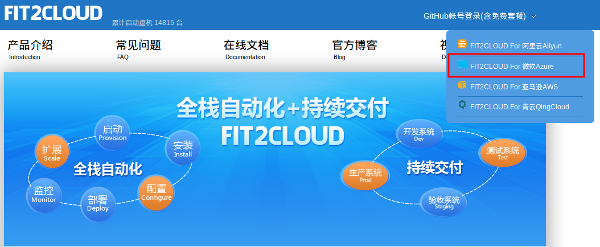

| **2) 点击"Github帐号登陆"后，会弹出Github登陆页面，要求输入Github用户名密码**
|
| **3) 输完用户名密码，点击登陆后，会到授权页面，选择 "授权(Authorize)" 即可, 之后就进入FIT2CLOUD的开始页面**

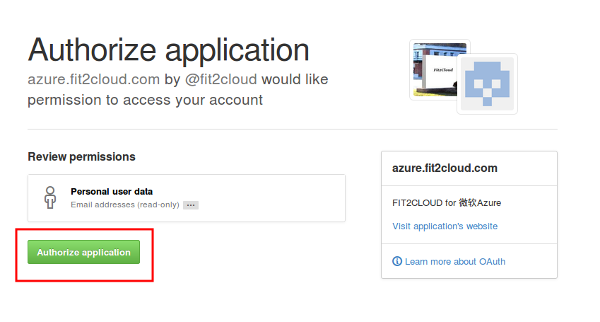

| **4) 之后会跳转回FIT2CLOUD，填入个人信息**

.. image:: _static/azure/user_info.png

一: 绑定Azure 账号
-------------------------------------

| 首先你需要注册一个Azure账号,访问 www.windowsazure.cn, 按Azure引导注册使用。

| 当开通Azure之后，访问我的账户->管理，并在设置中找到订阅

.. image:: _static/azure/azure_controll.png

| 在订阅中选择我们的订阅，由于本次测试账号使用的预付费账号，所以选择"Standard Pay-in-Advance Offer"

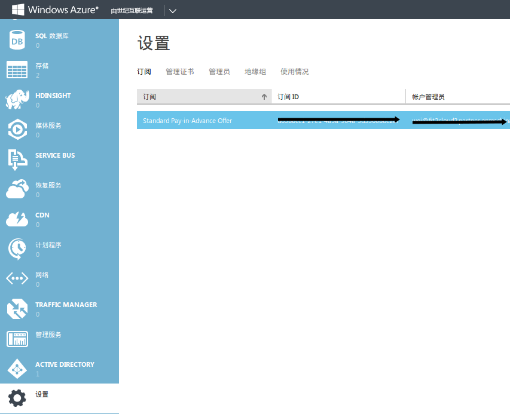

| 
| 之后，FIT2CLOUD 将这一步变得十分简捷，只需要简单的下载安全证书，导入证书即可。
| **1) FIT2CLOUD开始页，选择“绑定Azure 账号”**

.. image:: _static/auzre/bind_key.png

| **2) 在弹出页点击下载链接**

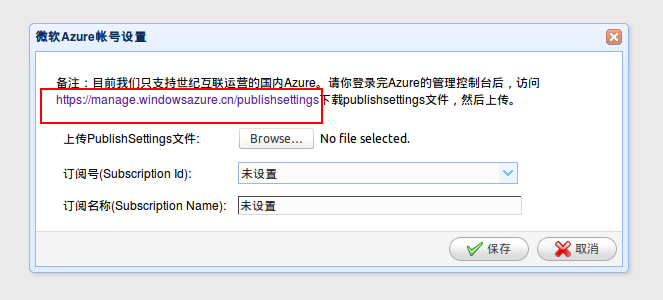

| **3) 如果您已经登陆了azure账号，则会自动下载证书**

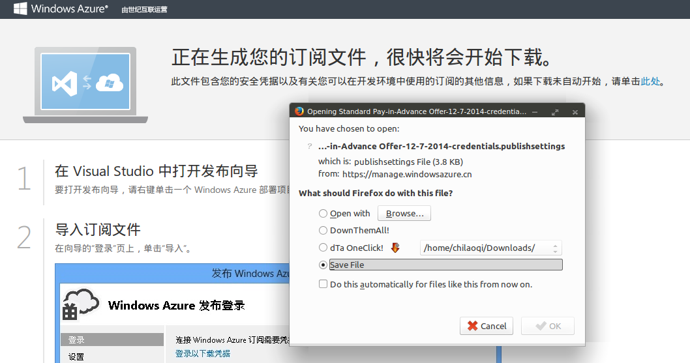

| **4) 紧接着上传你下载的证书，点击保存，如果正确，会显示验证成功。**

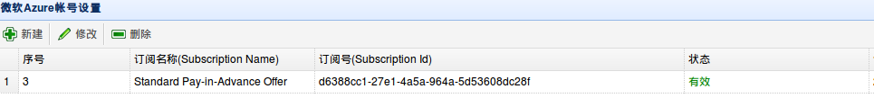

二: 创建虚拟机组
--------------------------------------------------------------------------

第一步: 创建wordpress-mysql虚拟机组
^^^^^^^^^^^^^^^^^^^^^^^^^^^^^^^^^^^^^^^^^^^^^^^^^^^^^^^^^^^^^^^^^^^^^^^^^^^^^^^^^^^^^^^^^^^^^^^^^^^^^^^^

|
| **1) 到"开始页", 选择"创建虚拟机组"**

| **2) 填写虚拟机组配置信息并保存**

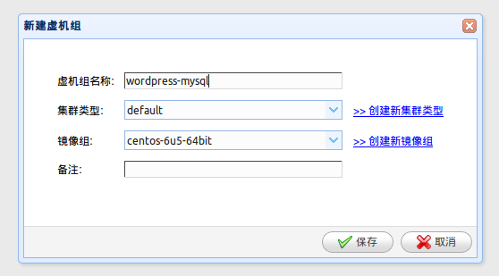
 
| **3) 编辑wordpress-mysql虚拟机组事件处理脚本**

| **> 选择编辑事件处理脚本**

.. image:: _static/002-CreateVMGroup-3-SelectEditEventHandlers.png

| **> 选择编辑本机install事件本机处理脚本**
| **> 将下面的mysql安装脚本填写到wordpress-mysql虚拟机组的install事件本机处理器中并保存:**

| MySQL安装脚本

.. code:: python

	#!/bin/bash
	yum -y install mysql-server
	
	#chkconfig mysqld on
	#configure:
	/etc/rc.d/init.d/mysqld stop
	/etc/rc.d/init.d/mysqld start
	mysqladmin -u root password 'fit2cloud'
	
	mysql -u root -pfit2cloud -e "create database wordpress"
	mysql -u root -pfit2cloud -e "GRANT ALL PRIVILEGES ON *.* TO 'root'@'%' IDENTIFIED BY 'fit2cloud' WITH GRANT OPTION;flush privileges;"
	/etc/rc.d/init.d/mysqld restart

第二步: 创建wordpress-web虚拟机组
^^^^^^^^^^^^^^^^^^^^^^^^^^^^^^^^^^^^^^^^^^^^^^^^^^^^^^^^^^^^^^^^^^^^^^^^^^^^^^^^^^^^^^^^^^^^^^^^^^^^^^^^
|
| **1) 同上，到"开始页", 选择"创建虚拟机组"**

| **2) 填写虚拟机组配置信息并保存**

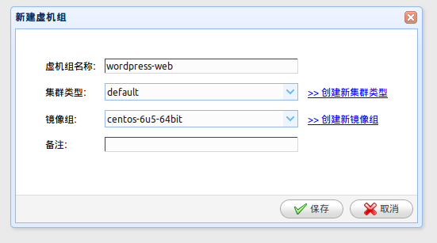
    
| **3) 编辑wordpress-web虚拟机组事件处理脚本**

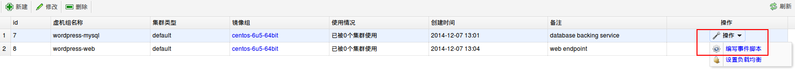

| **> 选择编辑wordpress-web虚拟机组事件处理脚本**

.. image:: _static/002-CreateVMGroup-6-SelectEditWebVMGroupEventHandlers.png

| **> 选择编辑本机initialize事件本机处理脚本, 编辑并保存**
|
| wordpress-web初始化运行时环境安装脚本

.. code:: python

	#!/bin/bash
	yum -y install httpd php php-mysql wget
	chkconfig httpd on

| **> 选择编辑本机install事件本机处理脚本, 编辑并保存**
|

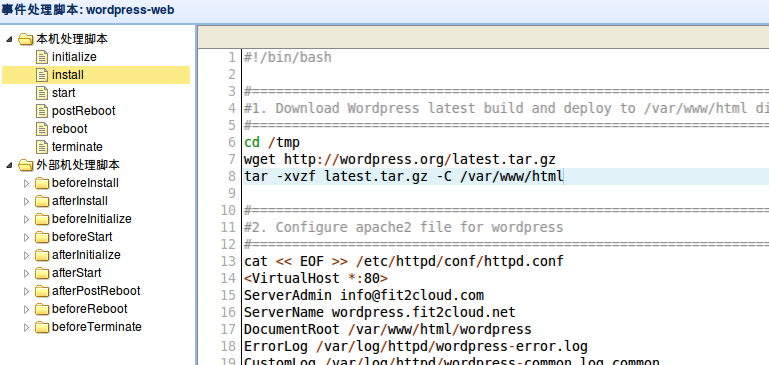

| wordpress-web安装脚本

.. code:: python

	#!/bin/bash
	cd /tmp
	wget http://repository-proxy.fit2cloud.com:8080/content/repositories/releases/com/tidakada/wordpress/4.0.1/wordpress-4.0.1-wordpress.gz
	mkdir -p /var/www/html
	tar -xvzf wordpress-4.0.1-wordpress.gz -C /var/www/html
	
	#configure apache2 file for wordpress
	cat << EOF >> /etc/httpd/conf/httpd.conf
	<VirtualHost *:80>
	ServerAdmin info@fit2cloud.com
	ServerName wordpress.fit2cloud.net
	DocumentRoot /var/www/html/wordpress
	ErrorLog /var/log/httpd/wordpress-error.log
	CustomLog /var/log/httpd/wordpress-common.log common
	</VirtualHost>
	EOF
	
	cp /var/www/html/wordpress/wp-config-sample.php /var/www/html/wordpress/wp-config.php
	sed -i "s/database_name_here/wordpress/g" /var/www/html/wordpress/wp-config.php
	sed -i "s/username_here/root/g" /var/www/html/wordpress/wp-config.php
	sed -i "s/password_here/fit2cloud/g" /var/www/html/wordpress/wp-config.php
        sed -i "s/fonts.googleapis.com/fonts.useso.com/g" `grep fonts.googleapis.com -rl /var/www/html/wordpress`
	
	service httpd restart
	
	#get mysql role server ip address
	waitOutput=`f2cadmin waitUntilServerUp wordpress-mysql 120`
	output=`echo $waitOutput | grep "vm is up"`
	if [ ${#output} -gt 0 ] ; then
	    getIPoutput=`f2cadmin get clusterrole_servers_info wordpress-mysql localIP | head -1`
	    
	    checkErrorOutput=`echo $getIPoutput | grep "does not exist"`
	    if [ ${#checkErrorOutput} -gt 0 ] ; then
	        echo "exceptions happens when get role server ip"
	        echo $output
	    else
	        echo $getIPoutput
	        mysqlInternalIP=$getIPoutput
	        sed -i "s/localhost/$mysqlInternalIP/g" /var/www/html/wordpress/wp-config.php
	    fi
	else
	   echo exceptions happens when wait until mysql server up, can not get mysql ip, can not configure wp-config.php
	   echo $waitOutput
	fi

| **4) 设置wordpress-web对外80端口访问权限**

| **a> 到"虚拟机组"页面, 选择"操作"->"设置负载均衡"**

| **b> 到"安全组规则"页面, 选择"新建" ; 新建负载均衡，开通wordpress-web的80端口对外访问权限**

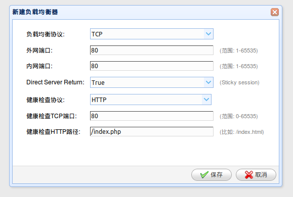

三: 新建集群及添加虚拟机组
--------------------------------------------

第一步: 新建集群
^^^^^^^^^^^^^^^^^^^^^^^^^^^^^^^^^^^^^^^^^^^^^^^^^^^^
| **1) FIT2CLOUD页面中选择"集群"**

.. image:: _static/azure/start_create_cluster.png

| **2) 集群列表页面，选择"新建"; 新建集群页面中，填写集群名称并保存**

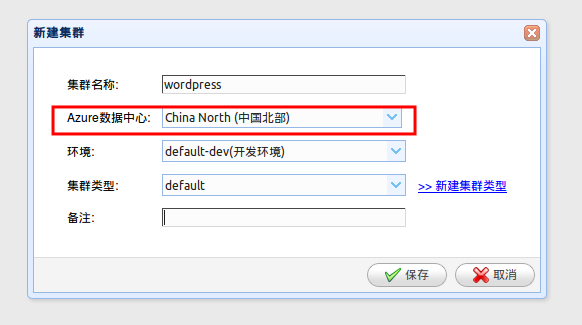

| 注意，FIT2CLOUD会自动创建管理中国北部和中国东部两个地缘组。

第二步: 添加wordpress-mysql虚拟机组
^^^^^^^^^^^^^^^^^^^^^^^^^^^^^^^^^^^^^^^^^^^^^^^^^^^^^^^^^^^^^^^^^^^^^^^^^^^^^^^^^^^^^^^^^^^^^^^^^^^^^^^^
|
| **1) 集群页面，选择 "wordpress"集群 -> "0个虚拟机组"**

| **2) 集群虚拟机组页面，选择 "新建" 虚拟机组**

| **3) 新建虚拟机组页面，配置wordpress-mysql虚拟机组并保存**

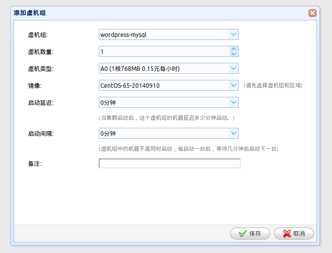

第三步: 添加wordpress-web虚拟机组
^^^^^^^^^^^^^^^^^^^^^^^^^^^^^^^^^^^^^^^^^^^^^^^^^^^^^^^^^^^^^^^^^^^^^^^^^^^^^^^^^^^^^^^^^^^^^^^^^^^^^^^^
|
| **1) 同上，集群页面选择 "wordpress"集群 -> "1个虚拟机组"**
| **2) 集群虚拟机组页面选择 "新建" 虚拟机组**
| **3) 新建集群虚拟机组页面配置wordpress-web虚拟机组并保存， 注意web是两台虚拟机**

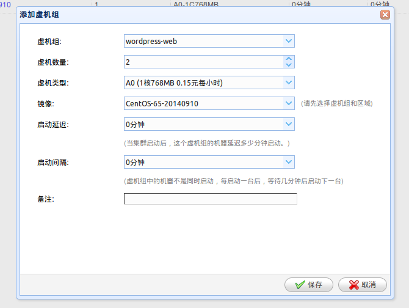

四: 启动集群
--------------------------------------------------------------------------

| **1) 集群列表页面，选择"wordpress"集群 ->  选择"启动"**

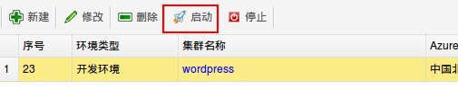

| 选择"启动"后，会出现下面的页面，显示集群将会在几分钟内启动

.. image:: _static/004-LaunchCluster-2-LaunchedInfo.png

| **2) 集群列表页面，选择集群"wordpress" -> 选择"3个虚拟机" 进入集群虚拟机列表页面**

| **3) 集群虚拟机列表页面，查看启动的虚拟机**

.. image:: _static/004-LaunchCluster-4-ViewClusterVMList.png

| **4) 找到wordpress-web虚拟机，公有IP，并在浏览器中输入http://<wordpress-web虚拟机公有IP>访问wordpress**

.. image:: _static/004-LaunchCluster-5-GetWebIP.png

.. image:: _static/004-LaunchCluster-6-ViewWordpressWeb.png

五: 管理集群
-------------------------------------

| 集群启动成功后，我们就可以管理这个集群，比如设置告警、执行脚本、设置自动伸、登录虚机等等。下面演示如何登录虚机。
| **集群虚拟机列表页面，点击某个虚拟机所在行选定要登录的虚拟机 -> 点击行最右边一列显示的 "操作" -> 在下拉列表中选择 "登录虚机"**

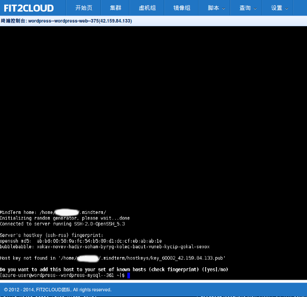

| 之后会弹出登陆页面，如果您的浏览器没有装Java(TM)插件，会弹出提示页面提示安装(如下面Chrome提示)

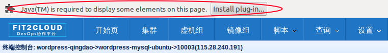

|
| **安装Java(TM)插件参考文档:**
| 1) 下载Java(TM)插件:           http://java.com/en/download/manual.jsp?locale=en
| 2) Linux下安装Java(TM)插件:    http://java.com/en/download/help/linux_install.xml
| 3) Windows下安装Java(TM)插件: http://java.com/en/download/help/windows_manual_download.xml
| 
|    顺便提及使用FIT2CLOUD方式建立集群有一个好处，就是可以将启动虚拟机和安装运行时环境及组件的工作全部
| 自动化，真正实现一键创建集群和部署应用。您可以把集群关闭后，再启动起来，不需要手工到阿里云里启动虚拟机，
| 也不需要手工登到虚拟机运行脚本，也不需要找到虚拟机的IP然后配置到某脚本中让脚本自动登陆安装。
|
|    最后, 这篇入门文档，简单介绍了FIT2CLOUD的一些基本功能，由于主题和篇幅的限制，还有很多非常有用的功
| 能以及一些高级功能没有介绍，比如查看集群的监控，费用，同时在集群内的多个虚拟机上执行脚本，将应用的部署
| 自动化，将应用的升级自动化，让集群内虚拟机按顺序启动，与持续集成系统集成实现持续部署, 自动恢复, 自动伸
| 缩等等,对于这些功能，详细介绍请移步到相应的文档，您可以在文档首页找到各个文档的入口链接，如有需求或碰到
| 问题，请联系support@fit2cloud.com。

.. code:: python    

       注: 到文档目录请点击下面的链接或页面左上角，左下角的文档目录链接。

|  `FIT2CLOUD在线文档 | 云管理及DevOps协作平台 <http://docs.fit2cloud.com/>`_

