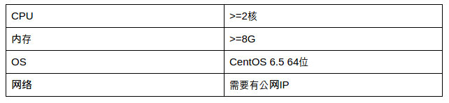

FIT2CLOUD企业版(阿里云)
=====================================

 FIT2CLOUD企业版部署在企业自己的云账户中，完全由企业自主控制，确保安全。企业版中的用户帐号由企业自己创建、管理。
 目前我们只推出针对阿里云的企业版。这里，我们简要企业版的订购、安装和使用过程。

一: 在阿里云工具市场中订购FIT2CLOUD企业版
-------------------------------------------------------------------------

 FIT2CLOUD在阿里云工具市场中售卖。企业版分为免费版本、100虚机版和200虚机版，免费版本可以最多可以管理20台虚机，
 100虚机版可以最多可以管理100台虚机，200虚机版最多可以管理200台虚机。免费版本可以无缝升级到100虚机版和200虚机版。
 所以，用户可以先订购免费版本，当虚机数量超过20后再升级到付费版本。

 我们在收到您的订单后，会给你提供FIT2CLOUD企业版的安装命令和文档。

二: 准备安装环境
-------------------------------------------------------------------------

 用户需要准备一台单独的虚机来安装FIT2CLOUD企业版。这台虚机的配置要求是：

 我们推荐用户订购一台2核8G的包月虚机来部署FIT2CLOUD企业版

三: 安装企业版
-------------------------------------------------------------------------

 虚机准备完成后，切换到root帐号下，执行命令开始安装：

.. code:: python

	ORDER_ID=订单号 bash -c "$(curl -sSL http://repository.fit2cloud.com/content/repositories/fit2cloud-public/com/fit2cloud/installer/install-aliyun-enterprise/0.1/install-aliyun-enterprise-0.1.sh)"
	
 安装脚本会先检查环境和订单号，如果验证通过，系统就用开始自动安装。正常情况下，整个自动化安装过程需要花费5分钟。
 安装完成后，会显示安装成功的提示。

四: 管理员登录并管理
-------------------------------------------------------------------------

 管理员的默认帐号为： admin/fitTocloud2015 。管理员登录URL为：http://机器公有IP/
 首次登录后，请修改密码。
 
 创建用户：管理员登录后，可以创建FIT2CLOUD用户。
 系统设置：用户需要配置告警邮件发送的SMTP信息。

五: 用户登录并使用Fit2Cloud
-------------------------------------------------------------------------

 请参考我们的在线文档。