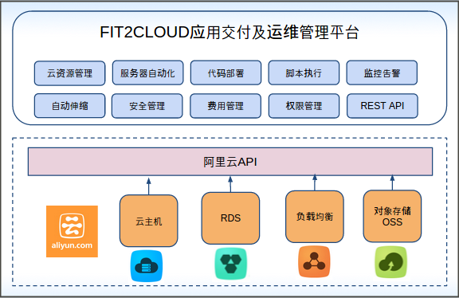

阿里云企业版部署和管理指南
====================================

**FIT2CLOUD阿里云企业版介绍**

FIT2CLOUD阿里云企业版于2015年3月上线阿里云官方镜像市场（ `FIT2CLOUD应用交付及运维管理平台[Centos 6.5 64位] <http://fit2cloud.com/introduction.html>`_ )；
是专为阿里云用户打造的一站式运维及持续交付平台，帮助用户打通从代码到服务的通道，其功能涵盖云资源管理、服务器自动化、应用代码管理、
应用部署、监控告警等，如下图所示：

**FIT2CLOUD阿里云企业版的特点**

| 1. 安装快速简单: FIT2CLOUD企业版以镜像方式交付，整个安装部署过程只需要几分钟就可以完成。
| 2. 系统管理方便: 集中管理云账号且所有操作可追踪，方便系统安全管理和审计。
| 3. 使用灵活高效: 支持导入虚机和FIT2CLOUD启动虚机两种模式，可管理高达万台虚机规模，提供代码部署、监控告警、批量脚本等丰富功能。
| 4. 数据安全可控: 整个FIT2CLOUD的数据都保存在用户的虚拟机上，FIT2CLOUD不会上传任何用户业务数据。

| 备注：FIT2CLOUD阿里云企业版在镜像市场上线初期为免费，用户只需支付ECS使用费即可使用镜像部署FIT2CLOUD企业版，
| 详情请查看 `这里 <http://help.aliyun.com/knowledge_detail.htm?knowledgeId=5974158>`_
| 如有你对FIT2CLOUD企业版有兴趣，请咨询support@fit2cloud.com。

**FIT2CLOUD阿里云企业版的部署和使用文档**

FIT2CLOUD阿里云企业版以镜像方式交付，部署非常简单，详细请参考我们的文档：`FIT2CLOUD应用交付及运维管理平台（Centos 6.5 64位）操作文档 <http://imagemarket.oss-cn-hangzhou.aliyuncs.com/FIT2CLOUD%E9%98%BF%E9%87%8C%E4%BA%91%E4%BC%81%E4%B8%9A%E7%89%88%20-%20%E9%83%A8%E7%BD%B2%E5%92%8C%E4%BD%BF%E7%94%A8%E6%8C%87%E5%8D%97%28v1.0%29.zip?spm=0.0.0.0.3qEjAC&file=FIT2CLOUD%E9%98%BF%E9%87%8C%E4%BA%91%E4%BC%81%E4%B8%9A%E7%89%88%20-%20%E9%83%A8%E7%BD%B2%E5%92%8C%E4%BD%BF%E7%94%A8%E6%8C%87%E5%8D%97%28v1.0%29.zip>`_

