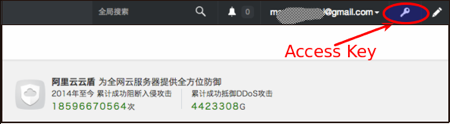
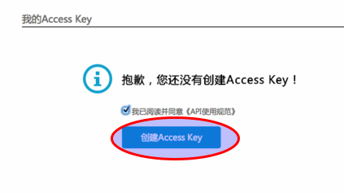
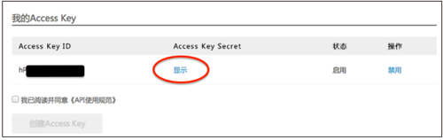

Fit2Cloud快速入门
=====================================

|       这里我们以在阿里云上建立一个wordpress网站为例, 了解Fit2Cloud的基本功能，看看如何通过Fit2Cloud方便快速地
| 在阿里云上部署和建立一个应用。

登录Fit2Cloud
------------------------------------

|     1) 在非IE浏览器里打开aliyun.fit2cloud.com
|           注1: 目前只支持Firefox, Chrome, 不支持渣渣IEx
|
|     2) 在页面右上角选择使用GitHub登录

一: 绑定阿里云API Key
-------------------------------------

| **第一步: 登录阿里云(www.aliyun.com)并确保账户有至少10元的余额**
|
|    注1: 如果没有阿里云帐号需要先注册一个 
|    注2: 如果余额为0先要用支付宝充值
|
| **第二步: 获取阿里云Access Key**
|
|   如果已创建过阿里云Access  Key，请直接到阿里云Access  Key页面;
|   如果没有阿里云Access  Key需要先创建一个;
|
| **> 阿里云首页, 选择"用户中心"**

| **> 用户中心页面选择"账户管理"**

|
| **> 账户管理页面选择"管理控制台"**

|
| **> 管理控制台页面选择"Access Key"进入阿里云Access Key页面**

|
| **> Access Key页面选择创建阿里云Access Key**

|
| **> Access Key页面查看阿里云Access Key**

|
| **第三步: 绑定阿里云Access  Key**
|
| **> Fit2Cloud开始页，选择"绑定阿里云API Key"**
.. image:: _static/001-BindKey-6-ClickBindKey.png

| **> Fit2Cloud Key管理页，选择default key并点击"修改"按钮**
.. image:: _static/001-BindKey-7-EditDefaultKey.png

| **> Access Key绑定页，填写阿里云Access Key ID and Secret并保存**
.. image:: _static/001-BindKey-8-FillKeyAndSave.png

二: 创建虚拟机组
-------------------------------------

| **1. 创建wordpress-web虚拟机组**
|
| 1) 到"开始页"
|             找到页面最上方一行，点击"开始页"
|
| 2) 选择"创建虚拟机组"
|
| 3) 填写虚拟机组配置信息并保存
|         
| 4) 编辑wordpress-web虚拟机组事件处理脚本
|
| 5) 设置wordpress-web虚拟机组安全组
|
| **2. 创建wordpress-mysql虚拟机组**
|
| 1) 到"开始页"
|             找到页面最上方一行，点击"开始页"
|
| 2) 选择"创建虚拟机组"
|
| 3) 填写虚拟机组配置信息并保存
|         
| 4) 编辑wordpress-mysql虚拟机组事件处理脚本
|

三: 创建集群
--------------------------------------------

|         **1) 到"开始页"**
|             找到页面最上方一行，点击"开始页"
|
|         **2) 选择"创建集群"**
|
|         **3) 填写集群配置信息并保存**
|         

四: 启动集群
-------------------------------------

.. line-block::
    
          1) 
五: 登录虚拟机
-------------------------------------

