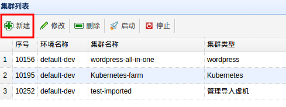
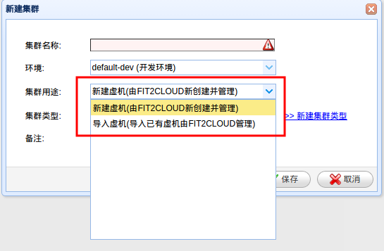
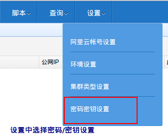
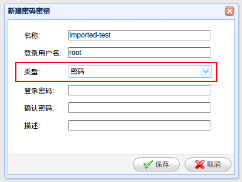
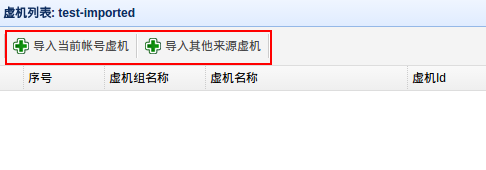
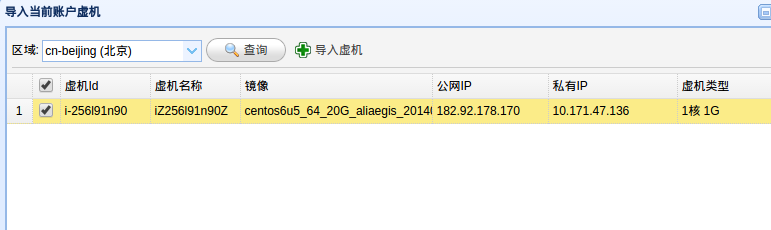
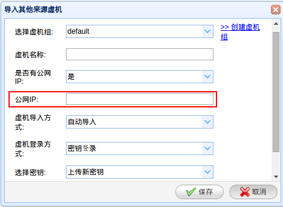

FIT2CLOUD 导入虚机功能
=========

一、导入虚机更方便用户
-------

FIT2CLOUD可以极大的方便用户管理虚机，提高云资源使用成熟度，而导入虚机功能，就是
建立在这一思想之上推出的服务。它能在很多方面帮助已有虚机用户解决实际问题，举例
如下：

| 1. 虚机分类的管理；
|    对于云服务（虚机）的使用，很多团队目前处于一个账号，多个项目组共用，由统一的人
| 负责管理虚机的分配创建，多个项目的云环境也混杂在一起。
|    而如果使用FIT2CLOUD的导入虚机功能，由FIT2CLOUD管理云资源（虚机），可以将不同用途
| 的，不同环境的虚机分类管理，创建不同的集群和虚机组类型。
| 
| 2. 执行脚本功能；
|    虚机的使用必然面临部署配置管理，FIT2CLOUD对于导入的虚机，可以做到一键部署配置，
| 按照需求，对不同的集群，虚机组，虚机执行部署配置脚本，最大化的减少使用云资源的复杂度，
| 同时提供脚本输出查询调试，降低出错可能性。
|
| 3. 统一配置的监控，告警功能;
|    FIT2CLOUD 可以对导入的虚机分类，统一配置监控阈值，告警短信和邮件通知，目前支持
| 虚机基本指标（CPU，内存，IO等）以及站点可用性的监控告警。
| 
| 4. 代码部署；
|    作为DevOPS中非常重要的一环，FIT2CLOUD推出了代码部署功能（CodeDeploy），用户只需
| 将打包（zip）好的build通过FIT2CLOUD部署到相应的虚机上，支持查看部署信息和结果，并且
| FIT2CLOUD提供部署Build Plan接口，支持自定义部署动作和健康检查。
|
| 5. 其他优点；
|    例如，明了的虚机费用信息，统一的虚机登录入口，以及虚机权限分配等。

二、导入前的准备工作
------

| 1. 建立集群和虚机组，自定义导入虚机的分类。步骤分别如下图所示:

| 集群用途处，选择导入虚机

| 当创建完集群，并自动分配了一个默认虚机组后，我们可以在集群列表页面看到
当前集群，虚机组1， 虚机0， 点击虚机按钮，可以进行后续导入虚机操作。

| 再进行后续导入虚机操作之前，我们先尝试创建手工导入虚机时需要的密码/密钥
|
| 2. 通过密码/密钥管理，创建导入虚机的登录密码，或者登录密钥
|   注：如果导入虚机时选择自动导入，则不需要创建密码/密钥

| 可以在类型中选择密码/密钥

三、 选择导入当前账号下虚机/导入其他虚机
------

重新回到上文提到的，正式开始导入虚机，目前FIT2CLOUD支持导入当前已绑定账号下的虚机以及其他任何一个有外网访问权限的虚机。

| 1. 如上图，如果选择导入当前账号下的虚机，FIT2CLOUD就会列出当前绑定的账号下的包月
|    的所有虚机，按需选择。如下图所示：

| 2. 如果选择导入其他虚机，则需要填入公网IP，如下图所示：

| 3. 无论导入虚机的来源是那种，都支持自动导入和手动导入，自动导入相对简单，只需要提供
|    密码/密钥，稍作等待，虚机就会导入成功。

| 4. 对于手动导入，不需要添加登陆信息，只需填入虚机外网IP，然后按照提示登陆虚机后执行一条命令即可。如下图所示：

| 5. 在虚机中，切换为root账户，执行FIT2CLOUD提供的命令，稍等片刻，在导入虚机界面，就可以看到导入虚机已经成功。

四、 导入虚机功能的限制
------
由于虚机操作系统的限制等，目前我们只支持CentOS 6.0 以上，以及Ubuntu 12.04以上版本
虚机OS类型，其他发行版未测试。
同时，被导入的虚机需要具备外网访问权限，虚机屏蔽Inbound 链接不影响 FIT2CLOUD虚机导入功能。
