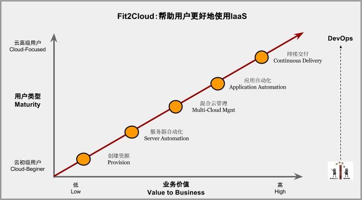
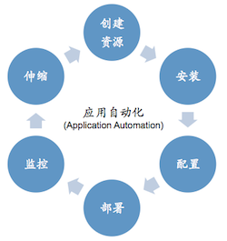
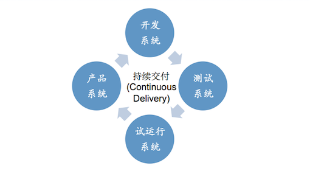
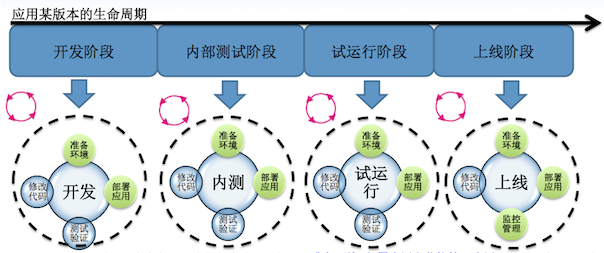

Fit2Cloud: 帮助用户更好地使用IaaS
===================================================================

|    CMMI即软件能力成熟度集成模型，是国际上衡量软件企业工程开发能力的一个重要标准。CMMI分为5级，
| 分别为初始级、可管理级、已定义级、量化管理级和优化管理级。在过去几年里，随着云计算的兴起，越来越
| 多的企业已经开始使用IaaS，但是这些企业对IaaS的使用成熟度差别很大。在这里，我们也对照CMMI成熟度
| 模型把IaaS云服务使用成熟度分为5级：
|
|     **第一级：只是通过IaaS快速创建资源(Provision Resources);**
|     **第二级：实现服务器自动化(Server Automation);**
|     **第三级：实现混合云的统一管理(Multi-Cloud);**
|     **第四级：实现应用自动化(Application Automation);**
|     **第五级：实现持续交付(Continuous Delivery);**

|	 目前，大多数的用户，使用IaaS服务，基本上只是使用IaaS快速地创建资源，即虚拟机，存储等， 使用
| IaaS云服务的成熟度为第一级，还有一些用户使用Chef, puppet实现了服务器自动化(Server Automation)，
| 即成熟度为第二级, 仅有少量用户达到了后面的级别，实现了应用自动化和持续交付，所以普遍使用IaaS的成
| 熟度提升上有很大的空间, 通过使用Fit2Cloud, 能够帮助用户更好地使用IaaS，提升云使用成熟度, 从而
| 更好地让IaaS为企业的业务服务，提升研发和运维的效率，服务的质量，同时按需使用以节约成本。 

第一级: 快速地创建资源(Provision Resources)
--------------------------------------------------------------------------
|     当做开发测试和运行应用服务时，都需要创建环境, 即获取主机，安装操作系统，配置存储和网络。通
| 过Fit2Cloud， 用户可以快速地在IaaS里创建出需要的虚拟机。 对于创建虚拟机，如果应用集群比较简单，
| 集群内虚拟机数量和类型较少时，手工通过IaaS的Web控制台是可以接受的，但是一旦虚拟机类型和数量很多
| 时，就要通过API的方式自动创建了，这方面典型的工具比如AWS的CloudFormation, 使用Fit2Cloud, 
| 用户可以事先定义好集群的虚拟机创建计划，然后Fit2Cloud就会根据计划自动快速创建出需要的大量各种不
| 同类型的虚拟机。除了快速创建资源外，Fit2Cloud还将这些虚拟机以集群和虚拟机组的单位进行了归类，从
| 而管理上也比IaaS的Web控制台方便许多, 不像在IaaS的Web控制台中，当虚拟机数量很多时，需要人手工根
| 据标签来查找虚拟机。

第二级: 实现服务器自动化(Server Automation)
--------------------------------------------------------------------------
|     当创建完环境后，即获得了应用运行需要的虚拟机, 存储，网络后，需要在各个虚拟机上安装应用运行时
| 需要的软件包和库，即运行时环境，通过Fit2Cloud, 用户可以设定虚拟机启动后要运行的软件包安装脚本， 
| 当虚拟机启动后， Fit2Cloud就会指定的脚本安装应用运行时需要的软件包库等, 从而实现服务器搭建配置的
| 自动化。 当服务器的应用运行时环境需要更改时，如打补丁时，可以使用Fit2Cloud的执行脚本功能，在指定
| 的多个虚拟机上执行，进行运行时环境的配置更改。

第三级: 实现混合云的统一管理(Multi-Cloud)
--------------------------------------------------------------------------
|     对于很多企业用户而言，基于当前的限制和某些方面的长远考虑，如
|         * 未最终决定使用哪个公有云或自己的私有云，暂时使用某个公有云
|         * 当前私有云还没建好，暂时使用公有云
|         * 私有云容量有限，需要公有云进行资源扩展
|         * 不想将应用服务锁定在某一个特定的公有云中
|         * 减少服务可用性风险
|         * 基于备份，安全方面考虑
|         * 使用现成的云服务备份数据
|     基于以上考虑，用户往往会同时使用公有云或私有云，比如AWS中一套，私有云一套，当故障发生时，可以
| 进行方便快速地切换和恢复; 当需要从一个公有云迁移到另一个公有云时，可以方便地迁移，不需要做太大的调整。
| 通过使用Fit2Cloud, 用户可以通过统一的用户接口，概念，将应用部署到不同的公有云和私有云中并管理。

第四级: 实现应用自动化(Application Automation)
--------------------------------------------------------------------------
|     当我们做开发测试和运维时, 都少不了部署升级, 扩容和新建应用服务， 通过Fit2Cloud, 我们可以定义
| 一个应用的环境模板，即集群，及集群里的虚拟机组，然后设置各虚拟机组的组件自动部署脚本，这样每次启
| 动集群时，启动虚拟机的时候，可以将各个组件自动部署到虚拟机上，而不是每次手动登陆或者手动运行脚本
| 来部署。 当需要扩容增加某种类型的虚拟机服务器时，只需要修改虚拟机组的最小虚拟机数目，Fit2Cloud就
| 会自动启动指定类型的虚拟机，并在虚拟机启动后，自动安装配置启动组件。当需要建立新的应用服务器，直
| 接从应用的环境模板启动即可。

第五级: 实现持续交付(Continuous Delivery)
--------------------------------------------------------------------------
|     持续交付是很多研发组织的目标，Fit2Cloud提供了REST API及SDK，可以方便地与团队的配置管理和
| 持续集成服务器(如Jenkins)集成，以实现部署流水线, 对DTAP各个环境持续按需自动化部署升级及升级后的
| 自动化测试, 服务监控，从而最终实现持续交付。

