软件安装和应用部署
===================================================
|
|    通过FIT2CLOUD可以实现虚拟机启动后自动安装应用组件及其运行所需的运行时库,包,中间件等。
|    
|    如果我们手工做这件事时，比如要建一个wordpress网站，步骤如下:
|    1) 启动2台虚拟机;
|    2) 我们给这2台虚拟机分配角色，选择1台做wordpress web服务器, 1台做mysql服务器;
|    3) 登陆到wordpress web服务器上安装wordpress web及其需要的apache,php等等，
| 并在wordpress数据库连接配置文件里配置mysql服务器的IP和数据库的用户名密码;
|    4) 登陆到wordpress mysql服务器上安装mysql,并创建wordpress database，以及
| 设置用户名密码。
| 
|    下面我们看在FIT2CLOUD中如何做，在FIT2CLOUD中, 把用于部署和运行某应用的一组虚拟机叫做一个集群, 我
| 们首先根据上面的部署计划在Web控制台上创建一个集群部署计划, 然后让FIT2CLOUD执行这个集群的部署计划，先调用
| 阿里云的API启动集群部署计划定义的虚拟机，然后在虚拟机启动后根据计划部署配置和启动wordpress的各个组件。

.. code:: python

   注1: 集群部署计划会定义在哪个数据中心启动哪种配置的虚拟机，安装哪种操作系统, 虚拟机启动后如何部署配置
 和启动wordpress的各个组件。

.. code:: python

     注2: 基本概念及术语
     1) 集群: 把用于部署和运行某应用的一组虚拟机叫做一个集群
     2) 虚拟机组: 把集群中相同类型的一组虚拟机叫做一个虚拟机组
     比如wordpress网站的虚拟机有两个虚拟机组，一组是wordpress-web虚拟机组，里面有一台虚拟机, 另一组
   是wordpress-mysql虚拟机组，里面也有一台虚拟机, 不同类型的虚拟组里的虚拟机安装该组相应的运行时环境及组件。
   对于一个特定的虚拟机组，我们可以定义组内包括几台虚拟机，启动在阿里云的哪个数据中心，北京杭州香港还是青岛，
   每台虚拟机启动后装哪种操作系统，运行什么脚本, 装哪些软件，组件，如何配置数据库连接文件。这样，我们只要先定
   义好集群的部署计划，剩下就是FIT2CLOUD执行计划了, 执行完后就可以访问集群里部署的应用服务了。

|    所以接下来我们具体要做的就是，定义一个集群部署计划，告诉FIT2CLOUD如何创建一个集群, 如何在各个虚拟机上
| 安装应用组件及其运行时环境，然后启动集群让FIT2CLOUD执行这个计划:
|
|    1) 定义应用组件的运行时软件安装和组件部署计划.
|       a. 创建wordpress-mysql虚拟组, 设置install事件处理脚本安装mysql,配置root密码和创建wordpress database;
|       b. 创建wordpress-web虚拟组, 设置initialize事件处理脚本安装apache web服务器和php,设置install
| 事件脚本安装wordpress latest并配置数据库参数和启动。
|
|    2) 定义集群的虚拟机启动计划
|      创建一个集群，并将新建的wordpress-mysql, wordpress-web虚拟机组加入集群
|      a. 配置集群的wordpress-mysql虚拟机组，设置组里有一台虚拟机，启动在青岛，配置为xsmall, OS为CentOS6.5; 
|      b. 配置集群的wordpress-web虚拟机组，设置组里有一台虚拟机，启动在青岛，配置为xsmall, OS为CentOS6.5
|
|    3) 启动集群

.. code:: python

    注3: 做下面的操作以前需要先绑定阿里云的Access Key。

一: 创建虚拟机组
-------------------------------------

第一步: 创建wordpress-mysql虚拟机组
^^^^^^^^^^^^^^^^^^^^^^^^^^^^^^^^^^^^^^^^^^^^^^^^^^^^

|
| **1) 到"开始页", 选择"创建虚拟机组"**
|
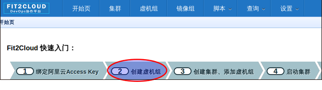
|
| **2) 填写虚拟机组配置信息并保存**
|
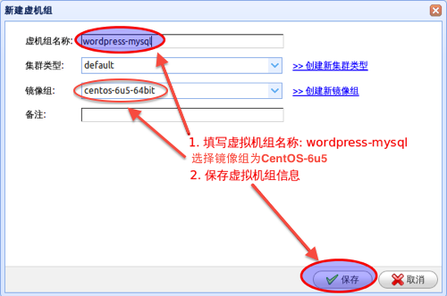
|         
| **3) 编辑wordpress-web虚拟机组事件处理脚本**
|
| **> 选择编辑事件处理脚本**
|
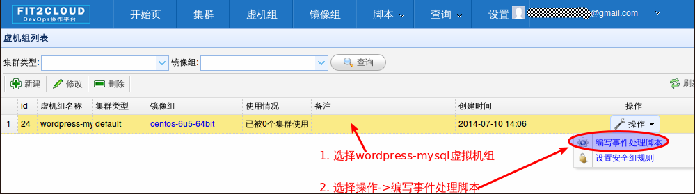
|
| **> 选择编辑本机install事件本机处理脚本**
| **> 将下面的mysql安装脚本填写到wordpress-mysql虚拟机组的install事件本机处理器中并保存:**

| MySQL安装脚本
.. code:: python

	#!/bin/bash
	yum -y install mysql-server
	
	#chkconfig mysqld on
	#configure:
	/etc/rc.d/init.d/mysqld stop
	/etc/rc.d/init.d/mysqld start
	mysqladmin -u root password 'fit2cloud'
	
	mysql -u root -pfit2cloud -e "create database wordpress"
	mysql -u root -pfit2cloud -e "GRANT ALL PRIVILEGES ON *.* TO 'root'@'%' IDENTIFIED BY 'fit2cloud' WITH GRANT OPTION;flush privileges;"
	/etc/rc.d/init.d/mysqld restart

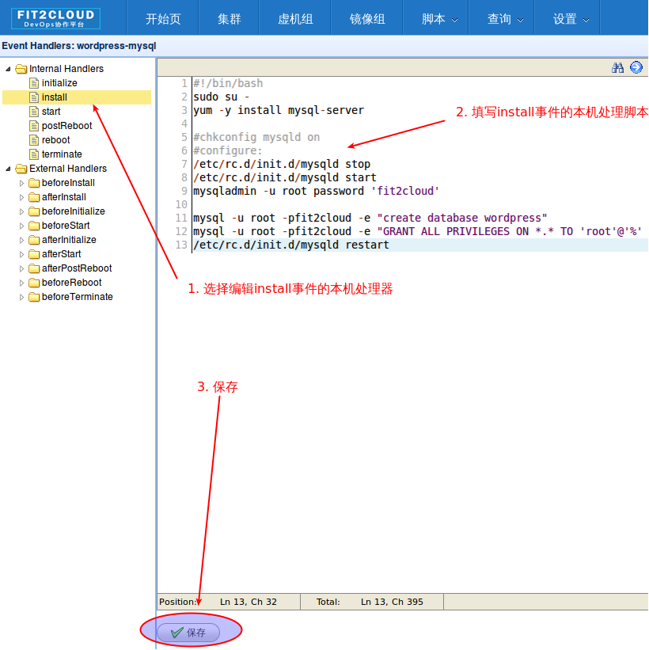
|
|
第二步: 创建wordpress-web虚拟机组
^^^^^^^^^^^^^^^^^^^^^^^^^^^^^^^^^^^^^^^^^^^^^^^^^^^^
|
| **1) 到"开始页", 选择"创建虚拟机组"**
|

|
| **2) 填写虚拟机组配置信息并保存**
|
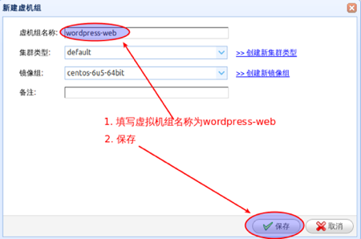
|         
| **3) 编辑wordpress-web虚拟机组事件处理脚本**

| **> 选择编辑wordpress-web虚拟机组事件处理脚本**
|
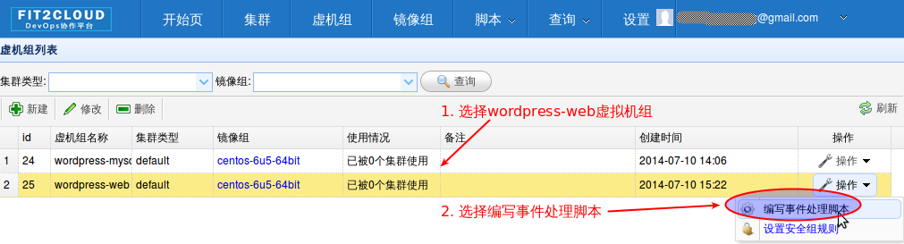
|
| **> 选择编辑本机initialize事件本机处理脚本, 编辑并保存**
|
| wordpress-web初始化运行时环境安装脚本
.. code:: python

	#!/bin/bash
	yum -y install httpd mysql-server php php-mysql wget
	#chkconfig mysqld on
	chkconfig httpd on

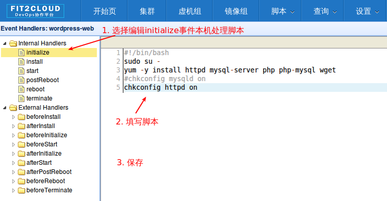

| **> 选择编辑本机install事件本机处理脚本, 编辑并保存**
|
| wordpress-web安装脚本
.. code:: python

	#!/bin/bash
	cd /tmp
	wget http://wordpress.org/latest.tar.gz
	mkdir -p /var/www/html
	tar -xvzf latest.tar.gz -C /var/www/html
	
	#configure apache2 file for wordpress
	cat << EOF >> /etc/httpd/conf/httpd.conf
	<VirtualHost *:80>
	ServerAdmin info@fit2cloud.com
	ServerName wordpress.fit2cloud.net
	DocumentRoot /var/www/html/wordpress
	ErrorLog /var/log/httpd/wordpress-error.log
	CustomLog /var/log/httpd/wordpress-common.log common
	</VirtualHost>
	EOF
	
	cp /var/www/html/wordpress/wp-config-sample.php /var/www/html/wordpress/wp-config.php
	sed -i "s/database_name_here/wordpress/g" /var/www/html/wordpress/wp-config.php
	sed -i "s/username_here/root/g" /var/www/html/wordpress/wp-config.php
	sed -i "s/password_here/fit2cloud/g" /var/www/html/wordpress/wp-config.php
	
	service httpd restart
	
	#get mysql role server ip address
	waitOutput=`f2cadmin waitUntilServerUp wordpress-mysql 120`
	output=`echo $waitOutput | grep "vm is up"`
	if [ ${#output} -gt 0 ] ; then
	    getIPoutput=`f2cadmin get clusterrole_servers_info wordpress-mysql localIP | head -1`
	    
	    checkErrorOutput=`echo $getIPoutput | grep "does not exist"`
	    if [ ${#checkErrorOutput} -gt 0 ] ; then
	        echo "exceptions happens when get role server ip"
	        echo $output
	    else
	        echo $getIPoutput
	        mysqlInternalIP=$getIPoutput
	        sed -i "s/localhost/$mysqlInternalIP/g" /var/www/html/wordpress/wp-config.php
	    fi
	else
	   echo exceptions happens when wait until mysql server up, can not get mysql ip, can not configure wp-config.php
	   echo $waitOutput
	fi

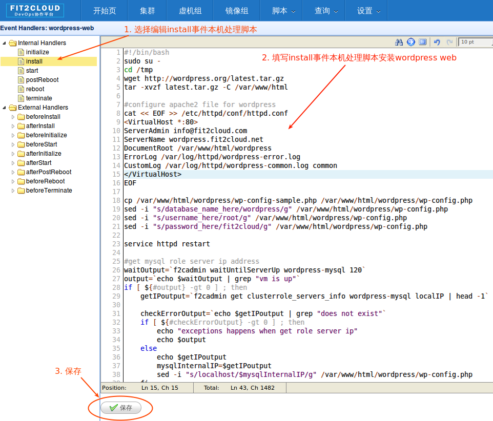

| **4) 设置wordpress-web虚拟机组安全组打开80端口**

| **a> 到"虚拟机组"页面, 选择"操作"->"设置安全组规则"**
|
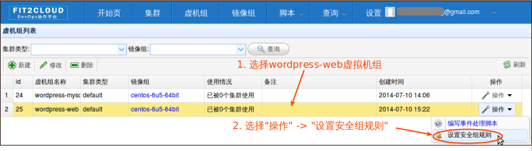
|
| **b> 到"安全组规则"页面, 选择"新建" ; 新建安全规则页面，填写打开80端口并保存**
|
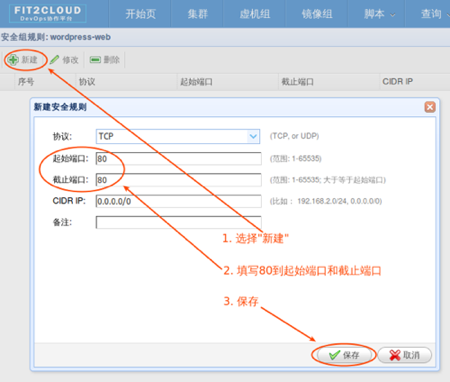
|
|
二: 创建集群
--------------------------------------------

第一步: 新建集群
^^^^^^^^^^^^^^^^^^^^^^^^^^^^^^^^^^^^^^^^^^^^^^^^^^^^
| **1) FIT2CLOUD页面中选择"集群"**
|
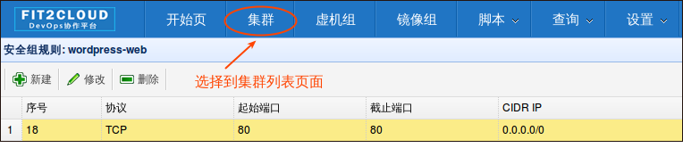
|
| **2) 集群列表页面，选择"新建"; 新建集群页面中，填写集群名称并保存**
|
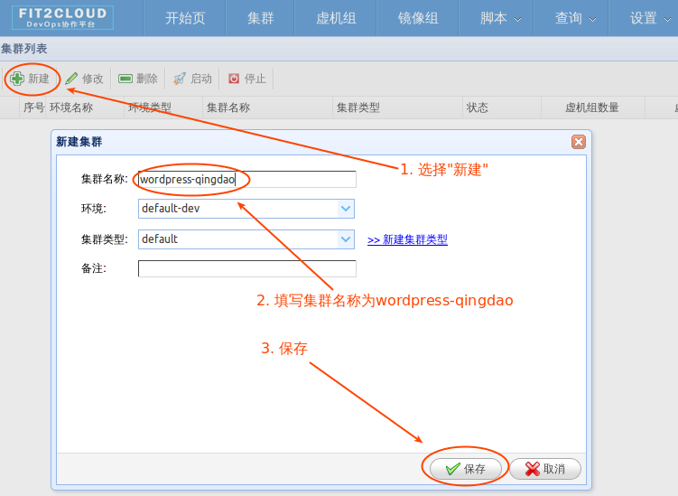
|
第二步: 添加wordpress-mysql虚拟机组
^^^^^^^^^^^^^^^^^^^^^^^^^^^^^^^^^^^^^^^^^^^^^^^^^^^^
|
| **1) 集群页面，选择 "wordpress"集群 -> "0个虚拟机组"**
|
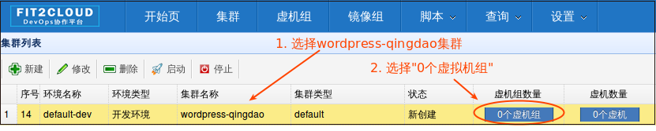
|
| **2) 集群虚拟机组页面，选择 "新建" 虚拟机组**
| **3) 新建虚拟机组页面，配置wordpress-mysql虚拟机组并保存**
|
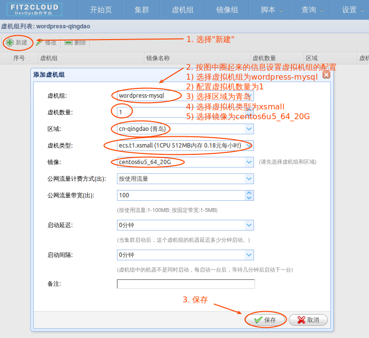
|
第三步: 添加wordpress-web虚拟机组
^^^^^^^^^^^^^^^^^^^^^^^^^^^^^^^^^^^^^^^^^^^^^^^^^^^^
|
| **1) 集群页面选择 "wordpress"集群 -> "1个虚拟机组"**
|

|
| **2) 集群虚拟机组页面选择 "新建" 虚拟机组**
| **3) 新建集群虚拟机组页面配置wordpress-web虚拟机组并保存**
|
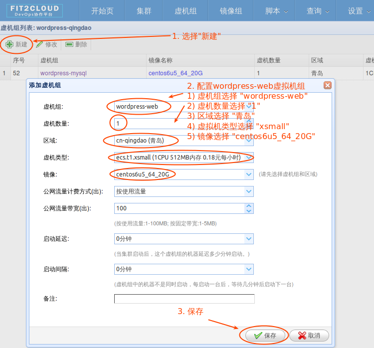
|
|
三: 启动集群
-------------------------------------

| **1) 集群列表页面，选择"wordpress-qingdao" ->  选择"启动"**
|
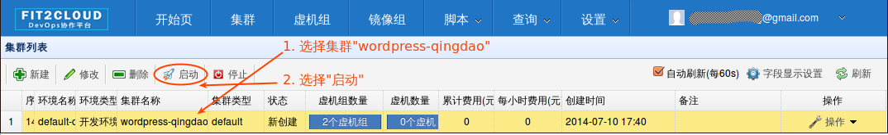
|
| 选择"启动"后，会出现下面的页面，显示集群将会在几分钟内启动
|
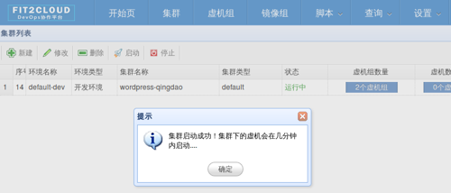
|
| **2) 集群列表页面，选择集群"wordpress-qingdao" -> 选择"x个虚拟机" 进入集群虚拟机列表页面**
|
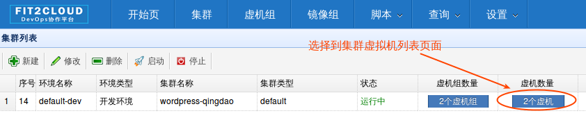
|
| **3) 集群虚拟机列表页面，查看启动的虚拟机**
|
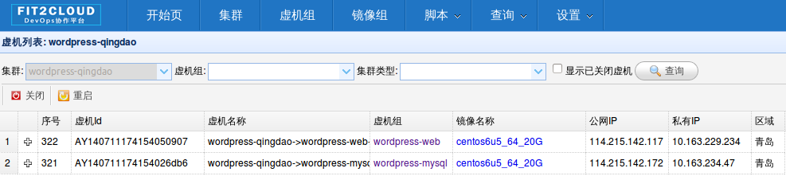
|
| **4) 找到wordpress-web虚拟机，公有IP，并在浏览器中输入http://<wordpress-web虚拟机公有IP>访问wordpress**
|
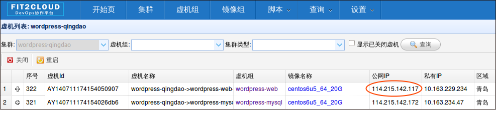
|
.. image:: _static/004-LaunchCluster-6-ViewWordpressWeb.png
|

|  注1: 软件安装和应用部署主要通过设置虚拟机组的事件处理脚本实现, 在实现某虚拟机上组件自动配置时，通常需要
| 获取集群内的虚拟机的IP地址信息，比如上面例子中在wordpress web虚拟机上自动配置数据库连接时需要知道mysql
| 虚拟机的IP地址，FIT2CLOUD提供了一个CLI工具f2cadmin可以获取到集群内所有虚拟机的信息，对于f2cadmin的具
| 体使用方法，请移步 FIT2CLOUD高级功能 -> f2cadmin命令行工具
|
|  注2: 直接在FIT2CLOUD Web控制台编辑保存的脚本是没有版本控制的，在实际的项目过程中，这些事件处理脚本也需
| 要版本控制，比如不同应用环境使用不同版本的事件处理脚本，以防止在开发过程中对脚本的改动影响到试运行以及产品环
| 境，所以您可以在控制台编辑保存的脚本中可以先调用f2cadmin获取集群信息，然后根据集群信息从您的事件处理脚本库
| 中下载当前集群对应版本的事件处理脚本，然后再执行。比如您有DTAP 4个环境，您可以让开发和测试环境都使用脚本库
| master分支的版本，让staing和产品环境使用app-devops库stable分支的版本。后续我们会在博客以及论坛中发布
| 相关的实践的例子供您参考。这里面的可扩展空间非常大，您可以使用Shell脚本，也可以使用puppet和chef, 也可以
| 使用python脚本。
|

