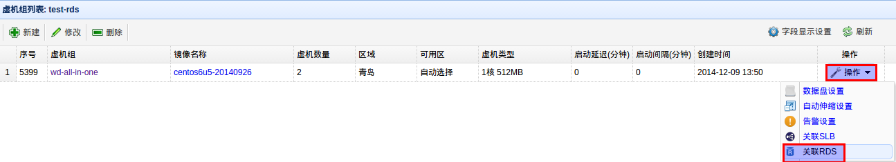
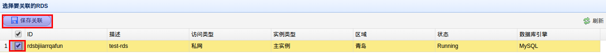
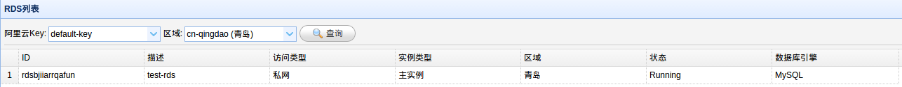
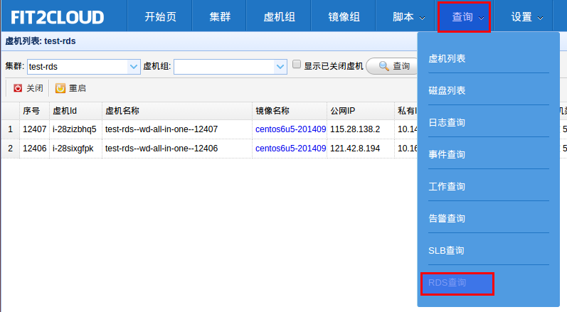
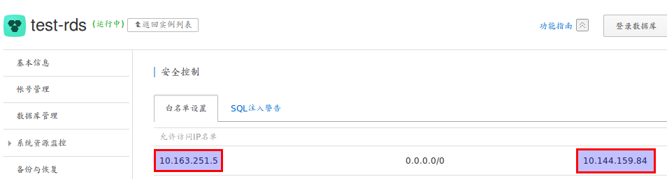

关联阿里云RDS
=====================================

由于RDS相对于用户自建数据库具有专业、高可靠、高性能、灵活易用等优点，
可以帮助用户解决费时费力的数据库管理任务，让用户将更多的时间聚焦在核心业务上。
越来越多的用户开始使用RDS.在FIT2CLOUD中,您可以为一组同类型的虚拟机关联您在阿里云上的这些RDS实例.
当您为虚拟机组关联上相应的RDS实例后,该虚拟机组启动的所有虚拟机将自动的添加到这些RDS的白名单中.
为虚拟机组关联RDS实例的步骤如下:

| 1) 进入集群列表页面
|
| 2) 在集群列表页面，点击某集群的"虚拟机组按钮"进入其虚拟机组列表页面
|
| 3) 在集群的虚拟机组列表页面，选择"新建"
|
| 4) 在新建虚拟机组对话框中注意选择与要关联的RDS相同的"区域", 其他设置请按需选择
|
| 5) 选择新建虚拟机组"操作"按钮,在下拉列表中选择"关联RDS"，进入RDS关联页面

|
| 6) 在RDS关联页面, 选择需要关联的RDS(可多选), 点击"保存关联"按钮进行保存

|
| 7) 可以在RDS查询页面查看RDS相关信息

| 8) 当集群的虚拟机成功启动后,FIT2CLOUD会根据关联的RDS实例的类型(公网或私网),
自动选择将虚拟机的IP(公网或私网)添加到对应的白名单中

