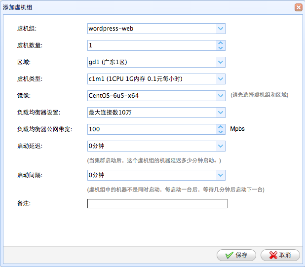
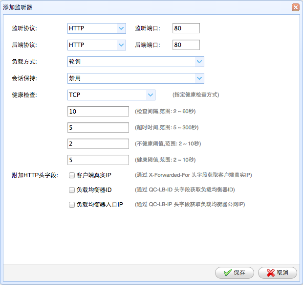

设置负载均衡
=====================================

一: 青云负载均衡设置
--------------------------------------------------------------

使用Fit2Cloud在青云中建立集群时，为一组同类型虚拟机配置负载均衡时，是通过配置
虚拟机组的负载均衡器来实现的，当Fit2Cloud根据某虚拟机组的启动计划启动一组虚拟机
后，Fit2Cloud会根据该虚拟机组的负载均衡器配置计划，配置负载均衡器。步骤如下:

 1) 进入集群列表页面

 2) 在集群列表页面，点击某集群的"虚拟机组按钮"进入其虚拟机组列表页面

 3) 在集群的虚拟机组列表页面，选择"新建"

 4) 在新建虚拟机组对话框中选择负载均衡器类型为"最大连接数10万", 负载均衡器公网带宽100M并保存

 5) 选择新建虚拟机组操作按钮,在下拉列表中选择"负载均衡设置"，进入监听器列表页面

 6) 在监听器列表页面, 选择"新建", 进入新建监听器页面

 7) 在新建监听器页面, 设置监听器各项配置并保存

|       监听协议及端口
|       后端协议及端口
|       负载方式
|       会话保持
|       健康检查设置

