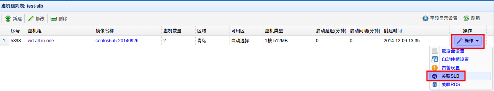
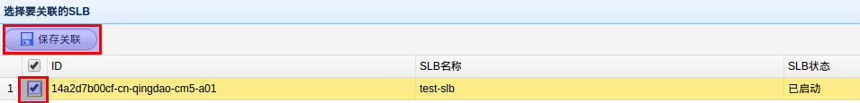
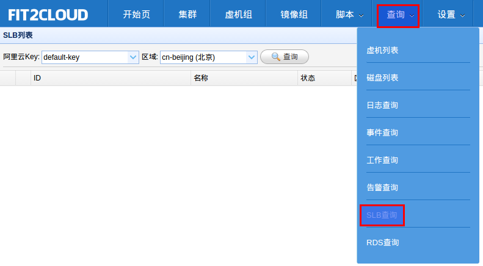
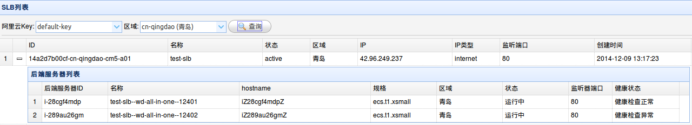

关联阿里云SLB
=====================================

您也许在阿里云上创建了许多SLB(公网或私网),在FIT2CLOUD中,您可以为一组同类型的虚拟机关联这些SLB.
当您为虚拟机组关联上相应的SLB后,该虚拟机组启动的所有虚拟机将自动的添加到这些SLB的
后端服务器中.为虚拟机组配置SLB的步骤如下:

| 1) 进入集群列表页面
| 2) 在集群列表页面，点击某集群的"虚拟机组按钮"进入其虚拟机组列表页面
| 3) 在集群的虚拟机组列表页面，选择"新建"
| 4) 在新建虚拟机组对话框中注意选择与要关联的SLB相同的"区域", 其他设置请按需选择
| 5) 选择新建虚拟机组"操作"按钮,在下拉列表中选择"关联SLB"，进入SLB关联页面

| 6) 在SLB关联页面, 选择需要关联的SLB(可多选), 点击"保存关联"按钮进行保存

| 7) 启动集群后,等待虚拟机运行起来后,可以在SLB查询页面查看SLB相关信息

| 8) 等待虚拟机的健康检查状态为正常后,就可以通过SLB进行访问了

