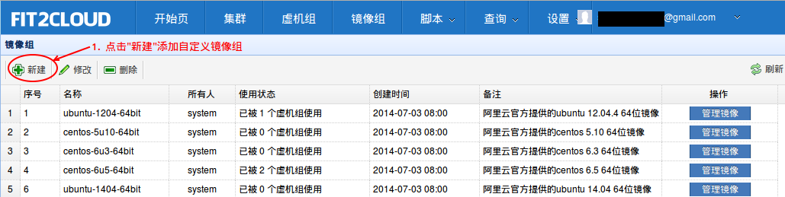
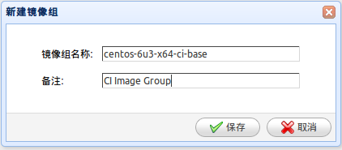
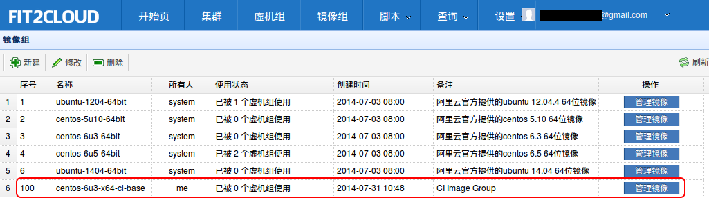
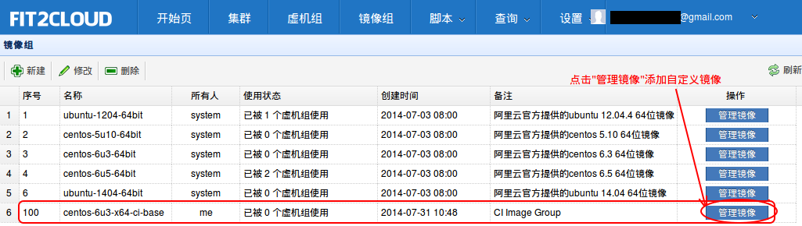
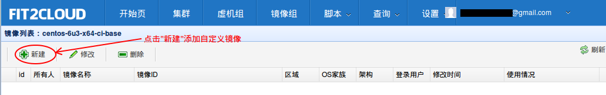
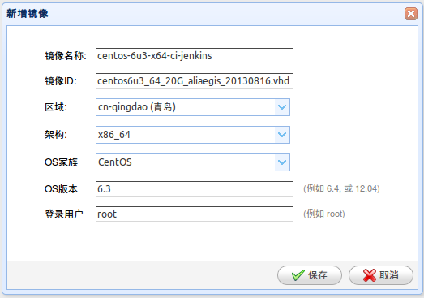
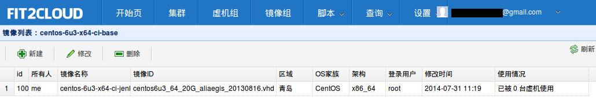

使用自定义镜像
===========================================

|
|   如果您想用您在阿里云中制作的自定义镜像启动虚拟机，您可以将自定义镜像注册到Fit2Cloud中, 然后
| 在添加或修改集群虚拟机组设置时, 指定使用您的自定义镜像启动虚拟机组中的虚拟机。
|
|   第一步: 在控制台最上方一行菜单中，点击 "镜像组" 进入 "镜像组列表页面"

|   第二步: 在镜像组列表页面, 点击 "新建" 进入 "新建镜像组页面", 在该页面填写镜像组名称和描述, 然后保存

|   第三步: 保存成功后, 将返回到 "镜像组列表页面",可以看到刚刚新增的自定义镜像组

|   第四步: 在镜像组列表页面, 选择 第三步新建的镜像组，点击 操作列的 "管理镜像" 进入 "镜像列表页面"

|   第五步: 在镜像列表页面, 点击 "新建" 进入 "新建镜像页面" 

|   第六步: 在"新建镜像页面", 填写镜像信息后保存(如下图所示):
|          a) 镜像名称
|          b) 镜像ID
|          c) 区域
|          d) 架构
|          e) OS家族
|          f) OS版本
|          g) 登陆用户

|	可以看到在镜像列表页面中显示出了刚刚添加的自定义镜像

|   之后，当您在集群中添加虚拟机组时，您可以虚拟机组的设置页面中通过选择镜像组名称，地区，以及
| 镜像，当启动集群后, 当启动虚拟机组内的虚拟机时，Fit2Cloud会用您指定的镜像启动。
